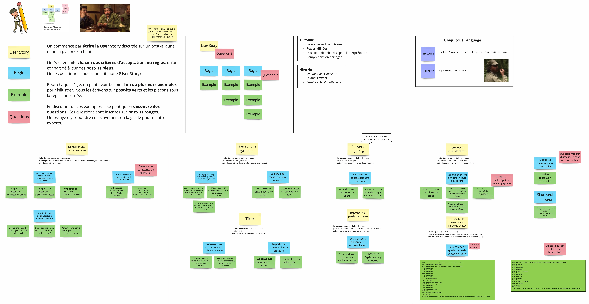

# Le bon chasseur, le mauvais chasseur, et le bon test

[](https://github.com/ythirion/le-bon-chasseur-le-mauvais-chasseur-et-le-bon-test/actions/workflows/sonarcloud.yml)
[](https://github.com/ythirion/le-bon-chasseur-le-mauvais-chasseur-et-le-bon-test/actions/workflows/slides.yml)
[](https://sonarcloud.io/summary/new_code?id=ythirion_le-bon-chasseur-le-mauvais-chasseur-et-le-bon-test)
[](https://sonarcloud.io/summary/new_code?id=ythirion_le-bon-chasseur-le-mauvais-chasseur-et-le-bon-test)
[](LICENSE)

[](https://codescene.io/projects/82673)
[](https://codescene.io/projects/82673)
[](https://codescene.io/projects/82673)
[](https://codescene.io/projects/82673)

> "Le mauvais chasseur, il voit un truc qui bouge, il tire. 
> Le bon chasseur, il voit un truc qui bouge, il tire… mais c'est un bon chasseur."


> "Le mauvais test, il assert un truc, il passe au vert. Le bon test, il assert un truc, il passe au vert… mais c'est un bon test."

Vu de loin, les deux tests se ressemblent : verts, rapides, présents dans la CI depuis toujours. Vu de près, un seul des deux protège vraiment quelque chose.

Concrètement, qu'est-ce qui sépare un vrai bon test d'un test qui fait semblant ? Pourquoi certaines suites de tests deviennent un harnais qui permet de refactorer en confiance, et d'autres un boulet qu'on désactive au premier sprint chargé ? C'est cette question qu'on va disséquer, une histoire à la fois.

## Origine
Atelier créé pour le [Devfest Dijon 2026](https://devfest.developers-group-dijon.fr/) en me basant sur un précédent atelier nommé le [Refactoring du Bouchonnois](https://github.com/ythirion/refactoring-du-bouchonnois/).

## Le contexte
Nos vaillants chasseurs du Bouchonnois ont besoin de pouvoir gérer leurs parties de chasse.
Ils ont fait développer un système de gestion par l'entreprise `Toshiba`... et depuis, plus rien n'avance.

Chaque nouvelle fonctionnalité prend plus de temps que la précédente. L'entreprise leur parle d'une soi-disant `dette technique` qui les ralentit - sans jamais vraiment l'expliquer.

[](https://youtu.be/QuGcoOJKXT8?si=N0e-w8GhgEnrBWv4)

Pourtant, sur le papier, tout va bien : la CI est verte, les tests passent, le coverage affiche de bons chiffres. Sauf que personne n'ose plus toucher au code sans croiser les doigts. 

> Un signe qui ne trompe pas : quand une suite de tests verte n'inspire plus confiance à personne, le problème n'est pas dans le code de production. Il est dans les tests eux-mêmes.

Les chasseurs comptent sur nous pour aller voir ce qui se cache vraiment derrière ce vert.

### Example Mapping
Ils ont fait quelques ateliers avec `Toshiba` et ont réussi à clarifier ce qui est attendu du système.
Pour ce faire, ils ont utilisé le format `Example Mapping` à découvrir [ici](https://xtrem-tdd.netlify.app/Flavours/Practices/example-mapping).

Voici l'`Example Mapping` qui a servi d'alignement pour développer ce système.



Version PDF disponible [ici](example-mapping/example-mapping.pdf)

## L'atelier
Une base de code en `C#` / `.NET 10` : les chasseurs du Bouchonnois et leurs parties de chasse aux galinettes qu'on va reprendre ensemble.

Sauf qu'ici, le gibier n'est pas sur le terrain de Pitibon sur Sauldre. Il est dans les tests. À chaque histoire, on part à l'affût d'une espèce différente de mauvais test - celui qui ment, celui qu'on ne comprend plus, celui qu'on n'ose plus toucher - avec, à chaque fois, le même déroulé : un symptôme, un diagnostic, un remède.

- [Histoire 1 : Le bon test ne ment pas](histoires/01.le-bon-test-ne-ment-pas/enonce.md) : la chasse aux mutants, pour débusquer les assertions qui passent toujours, parce que *"never trust a test you haven't seen fail"*.
- [Histoire 2 : Le bon test, on le lit](histoires/02.le-bon-test-on-le-lit/enonce.md) : Test Data Builders, Object Mothers, DSL Given/When/Then - ou comment transformer un test de 30 lignes en spec métier lisible en 5 secondes.
- **Histoire 3 : Le bon test, parfois, ne s'écrit pas à la main** : l'Approval Testing pour les scénarios à grosses assertions, et les pièges qui vont avec.
- **Histoire 4 : Le bon test couvre ce que tu n'as pas pensé à tester** : une propriété, 100 exécutions, et les cas tordus que t'aurais mis des mois à imaginer seul.
- **Histoire 5 : Le bon test protège l'architecture** : matérialiser les règles d'oignon, d'hexagonal, de Clean Architecture en tests qui échouent au premier merge incorrect.

## Slides
Les slides de présentation ([Slidev](https://sli.dev/), thème custom repris de la charte visuelle de l'atelier) sont dans [`slides/`](slides).

En ligne : **https://ythirion.github.io/le-bon-chasseur-le-mauvais-chasseur-et-le-bon-test/**
(publiées automatiquement sur GitHub Pages à chaque changement dans `slides/` sur `main`)

**Lancer en local**
```bash
cd slides
npm install
npm run dev
```
Puis ouvre [http://localhost:3030](http://localhost:3030).

**Autres commandes utiles**
```bash
npm run build   # build statique dans slides/dist
npm run export  # export en PDF
```

### Pour qui ?
Développeur·se·s, tech leads, toute personne qui a déjà soupiré devant un fichier de tests de 900 lignes.
Des exemples concrets transposables à tous les langages.

Une fois cet atelier terminé, tu ne regarderas plus jamais un ✅ vert de la même façon.