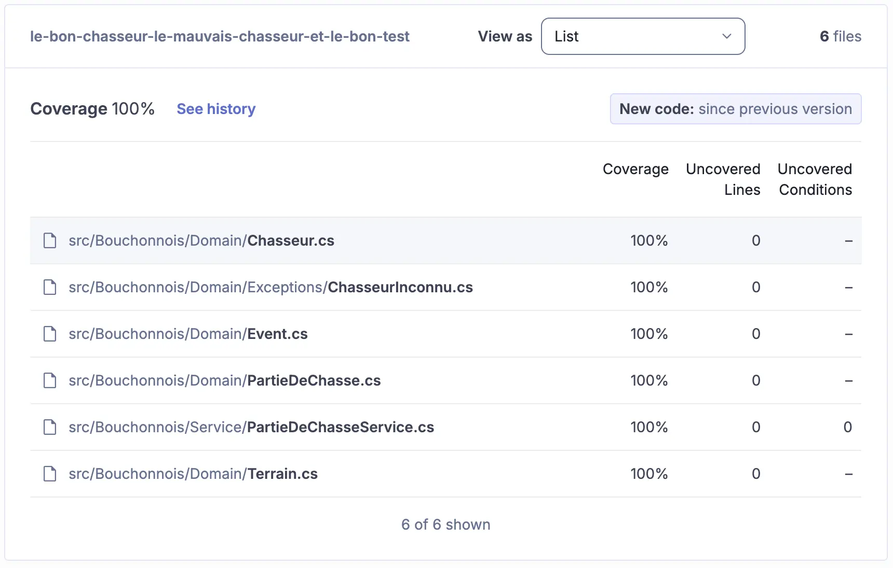

# Histoire 1 : Le bon test ne ment pas
> "Never trust a test you haven't seen fail." — Vladimir Khorikov

## Un test, en apparence propre
Le pipeline d'intégration continu est vert, la couverture de code affiche des chiffres flatteurs : [](https://sonarcloud.io/summary/new_code?id=ythirion_le-bon-chasseur-le-mauvais-chasseur-et-le-bon-test).

Voici un test du fichier `src/Bouchonnois.Tests/Service/PartieDeChasseServiceTests.cs` :

```csharp
public class TirerSurUneGalinette
{
    [Fact]
    public void AvecUnChasseurAyantDesBallesEtAssezDeGalinettesSurLeTerrain()
    {
        var id = Guid.NewGuid();
        var repository = new PartieDeChasseRepositoryForTests();

        repository.Add(new PartieDeChasse(id, new Terrain("Pitibon sur Sauldre") {NbGalinettes = 3},
        [
            new("Dédé") { BallesRestantes = 20 },
            new("Bernard") { BallesRestantes = 8 },
            new("Robert") { BallesRestantes = 12 }
        ]));

        var service = new PartieDeChasseService(repository, () => DateTime.Now);

        service.TirerSurUneGalinette(id, "Bernard");

        var savedPartieDeChasse = repository.SavedPartieDeChasse();
        Check.That(savedPartieDeChasse!.Id).IsEqualTo(id);
        Check.That(savedPartieDeChasse.Status).IsEqualTo(PartieStatus.EnCours);
        Check.That(savedPartieDeChasse.Terrain.Nom).IsEqualTo("Pitibon sur Sauldre");
        Check.That(savedPartieDeChasse.Terrain.NbGalinettes).IsEqualTo(2);
        Check.That(savedPartieDeChasse.Chasseurs).HasSize(3);
        Check.That(savedPartieDeChasse.Chasseurs[0].Nom).IsEqualTo("Dédé");
        Check.That(savedPartieDeChasse.Chasseurs[0].BallesRestantes).IsEqualTo(20);
        Check.That(savedPartieDeChasse.Chasseurs[0].NbGalinettes).IsEqualTo(0);
        Check.That(savedPartieDeChasse.Chasseurs[1].Nom).IsEqualTo("Bernard");
        Check.That(savedPartieDeChasse.Chasseurs[1].BallesRestantes).IsEqualTo(7);
        Check.That(savedPartieDeChasse.Chasseurs[1].NbGalinettes).IsEqualTo(1);
        Check.That(savedPartieDeChasse.Chasseurs[2].Nom).IsEqualTo("Robert");
        Check.That(savedPartieDeChasse.Chasseurs[2].BallesRestantes).IsEqualTo(12);
        Check.That(savedPartieDeChasse.Chasseurs[2].NbGalinettes).IsEqualTo(0);
    }
```

Et voici le code de production qu'il exerce, dans `src/Bouchonnois/Service/PartieDeChasseService.cs` :

```csharp
chasseurQuiTire.BallesRestantes--;
chasseurQuiTire.NbGalinettes++;
partieDeChasse.Terrain.NbGalinettes--;
partieDeChasse.Events.Add(new Event(_timeProvider(), $"{chasseur} tire sur une galinette"));
```

### Ta mission (partie 1)
Lis ces deux extraits et liste **tout ce qui te semble suspect** dans ce test. À première vue, il a l'air exemplaire - il pousse même l'assertion jusque dans le détail de chaque chasseur.

Pose-toi ces questions pour t'aider :
- Qu'est-ce que ce test affirme (`assert`) exactement ? Fais la liste de tout ce qui est vérifié.
- Le code de production fait 4 choses. Combien d'entre elles sont réellement vérifiées par le test ?
- Si quelqu'un supprime la ligne `partieDeChasse.Events.Add(...)`, le test s'en rendrait-il compte ?
- Qu'est-ce que ça représente, une `Partie de chasse` qui "tire" sans laisser de trace de ce tir ?

Note tes réponses avant de continuer, on va y revenir.

## Les mensonges dans les tests
Un test vert ne dit qu'une seule chose : *"je n'ai pas échoué avec le code actuel"*. Il ne dit pas *"je vérifie que ce comportement métier est correct"*.

Regarde à nouveau `AvecUnChasseurAyantDesBallesEtAssezDeGalinettesSurLeTerrain` : il a l'air rigoureux, il vérifie l'`Id`, le `Status`, le `Terrain`, et l'état de chacun des 3 `Chasseurs`. Mais il ne vérifie jamais `Events`. 

Or `Events` est ce qui reconstitue tout l'historique d'une partie de chasse - regarde par exemple les tests de `ConsulterStatus` un peu plus bas dans le même fichier, qui rejouent une chronologie entière à partir de cette seule liste. 
Si un événement disparaît, se duplique ou change de contenu au moment où le chasseur tire, ce test ne le verra jamais.

Ce test **ment**. Il donne l'illusion d'une couverture exhaustive - il y a même plus d'assertions que d'habitude - alors qu'il ignore complètement ce qui semble être le cœur du système. 

> Et c'est particulièrement vicieux : plus un test a l'air minutieux, plus il inspire confiance à quiconque le lit ou le voit passer en CI.

## Couverture de code (Code Coverage)
On pourrait défendre `AvecUnChasseurAyantDesBallesEtAssezDeGalinettesSurLeTerrain` en argumentant que la ligne `partieDeChasse.Events.Add(...)` est bien "couverte" - exécutée pendant le test, juste jamais vérifiée.

Et ce n'est pas qu'un argument théorique : on a bien **100% de couverture** sur tous les fichiers.



> La couverture de code mesure quelle portion du code source est exécutée par la suite de tests.

```
Code Coverage (%) = ( Lignes exécutées par les tests / Lignes exécutables totales ) × 100
```

Sur notre exemple : la ligne `partieDeChasse.Events.Add(...)` est *exécutée* -> elle compte au numérateur. Que le test vérifie ou non son contenu n'entre nulle part dans le calcul.

**Règle fondamentale :**
- Une couverture **faible** (ex : 10%) prouve qu'on ne teste pas assez ✅
- Une couverture **élevée** (même 100%) ne prouve **pas** qu'on a de bons tests ❌

> La couverture est un bon **indicateur négatif**, mais un mauvais indicateur positif.

### Branch Coverage

La couverture de branches se concentre sur les structures de contrôle (`if`, `switch`) : combien de chemins sont traversés par au moins un test.

```
Branch Coverage (%) = ( Branches exécutées par au moins un test / Nombre total de branches ) × 100
```

```java
// 2 chemins possibles : length > 5 et length <= 5
// Un test sur un seul chemin = 50% de branch coverage
public static boolean isLong(String s) {
    return s.length() > 5;
}
```

Ici : `1 / 2 × 100 = 50%`. Un seul test (`isLong("hello") == false`) suffit à faire passer le `Code Coverage` de cette méthode à 100%, sans jamais exécuter la branche `true`.

Le coverage te dit où tu n'as *rien* testé. Il ne te dit jamais si ce que tu as testé est bien testé. 
Il nous faut un autre outil pour détecter ce genre de mensonges.

## Le concept : Mutation Testing
Prends quelques instants pour découvrir la page [`Mutation Testing`](https://xtrem-tdd.netlify.app/Flavours/Testing/mutation-testing).

L'idée : introduire volontairement un petit bug (un `mutant`) dans le code de production - inverser une condition, changer une chaîne de caractères, supprimer une ligne - puis relancer la suite de tests.

- Si (au moins) un test échoue -> le mutant est `tué` -> le comportement est réellement vérifié.
- Si tous les tests passent -> le mutant `survit` -> **aucun** test ne vérifie ce comportement, même si la ligne est "couverte" au sens classique du terme.

```
Mutation Score (%) = ( Mutants tués / Mutants générés ) × 100
```

Contrairement au `Code Coverage`, le dénominateur n'est pas "les lignes exécutées" mais "les altérations du comportement détectées". C'est ce qui permet à un code 100% couvert d'avoir un score de mutation bien plus bas - exactement ce qu'on soupçonne sur `PartieDeChasseService`.

C'est exactement le trou que le coverage ne peut pas voir. Parmi les mutations qu'on va rencontrer aujourd'hui :
- [`String mutation`](https://stryker-mutator.io/docs/mutation-testing-elements/supported-mutators/#string-literal) : une chaîne de caractères du code de production est modifiée (ex : le message métier de notre exemple) sans qu'aucun test ne le détecte.
- [`Statement mutation`](https://stryker-mutator.io/docs/mutation-testing-elements/supported-mutators/#string-literal) : un bloc de code entier est supprimé (ex : l'ajout d'un événement, ou une sauvegarde via repository) sans qu'aucun test ne le détecte.

[`Stryker.NET`](https://stryker-mutator.io/docs/stryker-net/introduction/) est l'outil qui va jouer ce rôle sur notre codebase `C#`.

## Mise en place
Installer l'outil (si ce n'est pas déjà fait) :
```bash
dotnet tool install -g dotnet-stryker
```

Depuis `src/`, lancer une première analyse :
```bash
cd src
dotnet stryker
```

Un rapport HTML est généré dans `StrykerOutput/<date>/reports/mutation-report.html`. Ouvre-le : chaque mutant apparaît en surbrillance dans le code, avec son statut (`Killed`, `Survived`, `No coverage`, ...).

## Ta mission (partie 2) : la chasse aux mutants
1. Dans le rapport `Stryker`, retrouve les mutants générés sur le bloc que tu as étudié plus haut (mutation de `string`, suppression de statement, ...) et repère ceux marqués `Survived`.
2. Compare ces mutants survivants à la liste que tu as notée en partie 1. Avais-tu identifié tous les trous ?
3. Formule, en une phrase, le problème général illustré par ce test : qu'est-ce qu'une assertion `sujette aux mutations`, et à quoi la reconnaît-on dans du code de test ?

> 💡 Indice : va voir les tests de `ConsulterStatus`, plus bas dans le même fichier. Qu'est-ce qu'ils te disent sur l'importance de `Events` dans ce système ?

## Pour aller plus loin (une fois le problème identifié)
Le même symptôme se répète sur les autres tests "heureux" du fichier (`Tirer.AvecUnChasseurAyantDesBalles`, `PrendreLApéro.QuandLaPartieEstEnCours`, `TerminerLaPartieDeChasse.*`, ...) : ils vérifient minutieusement `Terrain` et `Chasseurs`, jamais `Events`. On retrouve un problème différent, mais tout aussi révélateur, sur les tests d'erreur comme `EchoueAvecUnChasseurNayantPlusDeBalles`, `EchoueCarLeChasseurNestPasDansLaPartie` ou `ChasseurInconnu` : ils vérifient uniquement le *type* de l'exception levée, jamais le message métier ni l'événement associé.

Une fois que tu as compris *pourquoi* le mutant survit sur ce premier test, corrige-le, relance `Stryker`, observe le score de mutation progresser, puis élargis la correction aux tests voisins qui partagent le même symptôme.

## Reflect
Pour créer de bons tests, il est important de toujours se concentrer sur l'écriture de bonnes assertions - et encore mieux, de développer à l'aide de `T.D.D.`

Une bonne assertion ne se contente pas de vérifier qu'une exception attendue est levée : elle vérifie que le comportement métier attendu s'est bien produit (message, effets de bord, état sauvegardé, ...).