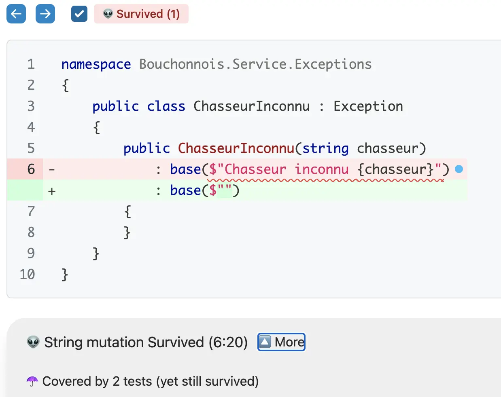
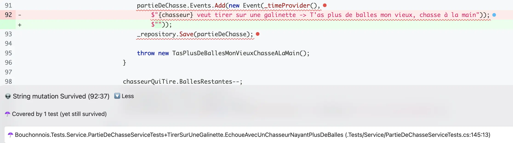
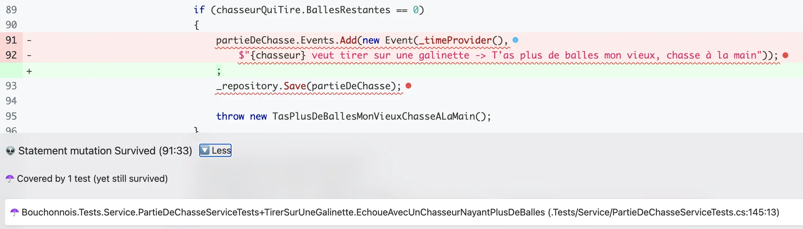
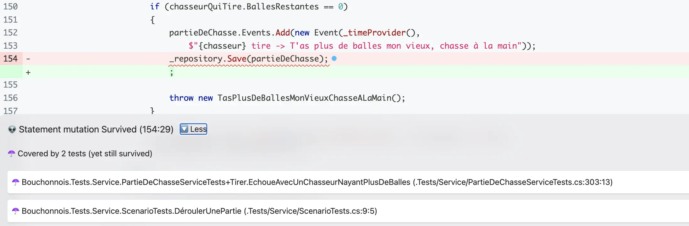
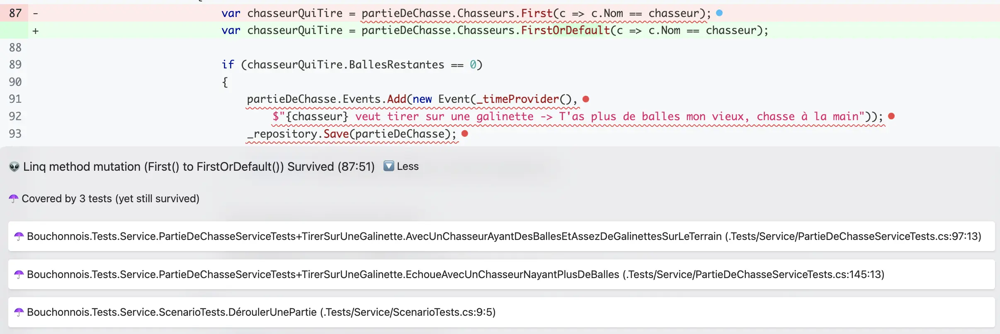

# Histoire 1 - Le bon test ne ment pas
Durant cette étape :
- Lancer [`stryker`](https://stryker-mutator.io/docs/stryker-net/introduction/)
  - Analyser les mutants survivants
- `Tuer` autant de mutants que possible (atteindre un score de mutation d'au moins 90%)

## Différents mutants
### [String mutation](https://stryker-mutator.io/docs/mutation-testing-elements/supported-mutators/#string-literal)
`Stryker` parvient à muter des `string` dans le code de production et ce changement n'est détecté par aucun test.

C'est le cas pour plusieurs classes : `ChasseurInconnu` et `PartieDeChasseService`.




`Cela fait-il du sens de vérifier ce genre de strings depuis nos tests ?`

### [Removal mutation](https://stryker-mutator.io/docs/stryker-net/mutations/#removal-mutators-statement-block)
`Stryker` parvient à supprimer certains blocs de code, tels que :

#### Ajout d'événements dans l'agrégat `PartieDeChasse`


#### Sauvegarde via repository


### [Linq Mutation](https://stryker-mutator.io/docs/stryker-net/mutations/#linq-methods-linq)
`Stryker` parvient à changer certaines expressions `LinQ`.



## `Tuer` les mutants
### Le point de départ : Events oublié
On reprend le test étudié dans l'énoncé, `AvecUnChasseurAyantDesBallesEtAssezDeGalinettesSurLeTerrain`. On lui ajoute la vérification de l'événement produit :

```csharp
[Fact]
public void AvecUnChasseurAyantDesBallesEtAssezDeGalinettesSurLeTerrain()
{
    var now = new DateTime(2024, 6, 6, 14, 50, 45);
    var id = Guid.NewGuid();
    var repository = new PartieDeChasseRepositoryForTests();

    repository.Add(new PartieDeChasse(id, new Terrain("Pitibon sur Sauldre") {NbGalinettes = 3},
    [
        new("Dédé") { BallesRestantes = 20 },
        new("Bernard") { BallesRestantes = 8 },
        new("Robert") { BallesRestantes = 12 }
    ]));

    var service = new PartieDeChasseService(repository, () => now);

    service.TirerSurUneGalinette(id, "Bernard");

    var savedPartieDeChasse = repository.SavedPartieDeChasse();
    ... // les assertions déjà existantes sur Terrain et Chasseurs

    Check.That(savedPartieDeChasse.Events).HasSize(1);
    Check.That(savedPartieDeChasse.Events[0])
        .IsEqualTo(new Event(now, "Bernard tire sur une galinette"));
}
```

🔵 Nous avons un problème avec la gestion du temps ici... Le service utilisait `() => DateTime.Now`, qui change à chaque exécution. Impossible de comparer un `Event` à une date fixe sans figer le temps.

🟢 On fige le temps dans le test (comme ci-dessus, via `var now = ...` injecté au service). Le mutant sur `partieDeChasse.Events.Add(...)` est désormais tué : si la ligne disparaît, `Events` est vide, `HasSize(1)` échoue.

### ChasseurInconnu
On ajoute l'assertion du message `métier` dans les tests en repartant des mutants listés dans le rapport de `Stryker` :

```csharp
[Fact]
public void EchoueCarLeChasseurNestPasDansLaPartie()
{
    ...
    Check.ThatCode(chasseurInconnuVeutTirer)
        .Throws<ChasseurInconnu>()
        .WithMessage("Chasseur inconnu Chasseur inconnu");

    Check.That(repository.SavedPartieDeChasse()).IsNull();
}
```

On peut alors relancer `Stryker` : le mutant de `string` sur le message de `ChasseurInconnu` est tué. On avance, mutant après mutant.

### PartieDeChasseService : le même problème sur les tests d'erreur
Comme pour le test du chemin heureux, on doit ajouter la vérification d'événement et de sauvegarde de la partie de chasse dans les tests qui lèvent une exception `métier` :

```csharp
[Fact]
public void EchoueAvecUnChasseurNayantPlusDeBalles()
{
    var now = new DateTime(2024, 6, 6, 14, 50, 45);
    ...
    var service = new PartieDeChasseService(repository, () => now);
    var tirerSansBalle = () => service.TirerSurUneGalinette(id, "Bernard");

    Check.ThatCode(tirerSansBalle).Throws<TasPlusDeBallesMonVieuxChasseALaMain>();

    var events = repository.SavedPartieDeChasse()!.Events;
    Check.That(events).HasSize(1);
    Check.That(events[0])
        .IsEqualTo(new Event(now,
            "Bernard veut tirer sur une galinette -> T'as plus de balles mon vieux, chasse à la main"));
}
```

🟢 On continue à tuer les autres mutants "similaires" sur le même modèle :

```csharp
[Fact]
public void EchoueSiLaPartieDeChasseEstTerminée()
{
    var now = new DateTime(2024, 6, 6, 14, 50, 45);
    ...
    var service = new PartieDeChasseService(repository, () => now);
    var tirerQuandTerminée = () => service.TirerSurUneGalinette(id, "Chasseur inconnu");

    Check.ThatCode(tirerQuandTerminée).Throws<OnTirePasQuandLaPartieEstTerminée>();

    var events = repository.SavedPartieDeChasse()!.Events;
    Check.That(events).HasSize(1);
    Check.That(events[0])
        .IsEqualTo(new Event(now, "Chasseur inconnu veut tirer -> On tire pas quand la partie est terminée"));
}
```

🔵 on a de la duplication dans les assertions (le `now` figé, la relecture du dernier événement) : on en profite pour la mutualiser. Comme les tests sont regroupés dans des classes imbriquées (`TirerSurUneGalinette`, `Tirer`, ...), on place le nécessaire dans la classe englobante `PartieDeChasseServiceTests` pour qu'il reste accessible partout :

```csharp
public class PartieDeChasseServiceTests
{
    private static readonly DateTime Now = new(2024, 6, 6, 14, 50, 45);
    private static readonly Func<DateTime> TimeProvider = () => Now;

    private static void AssertLastEvent(PartieDeChasse partieDeChasse, string expectedMessage)
    {
        Check.That(partieDeChasse.Events).HasSize(1);
        Check.That(partieDeChasse.Events[0]).IsEqualTo(new Event(Now, expectedMessage));
    }

    ...

    public class TirerSurUneGalinette
    {
        [Fact]
        public void EchoueAvecUnChasseurNayantPlusDeBalles()
        {
            ...
            var service = new PartieDeChasseService(repository, TimeProvider);
            var tirerSansBalle = () => service.TirerSurUneGalinette(id, "Bernard");

            Check.ThatCode(tirerSansBalle).Throws<TasPlusDeBallesMonVieuxChasseALaMain>();
            AssertLastEvent(repository.SavedPartieDeChasse()!,
                "Bernard veut tirer sur une galinette -> T'as plus de balles mon vieux, chasse à la main");
        }
    }
}
```

On répète cette même stratégie (figer le temps, vérifier le dernier événement, vérifier le message métier) sur tous les tests concernés - chemins heureux comme chemins d'erreur.

### LinQ mutation
Ces mutations sont un peu particulières dans notre cas :
```csharp
// On vérifie que le chasseur existe
if (partieDeChasse.Chasseurs.Exists(c => c.Nom == chasseur))
{
    // L'utilisation de First est dès lors "safe"
    var chasseurQuiTire = partieDeChasse.Chasseurs.First(c => c.Nom == chasseur);
    ...
}
```

Selon la version de `Stryker` installée, il est possible que le mutant généré sur ce bloc ne compile plus une fois intégré au code de production - `Stryker` l'écarte alors de lui-même. Vérifie dans ton rapport si c'est le cas.

Si le mutant survit malgré tout, on peut changer le code de production afin qu'il ne puisse plus être généré :
```csharp
if (partieDeChasse.Chasseurs.Exists(c => c.Nom == chasseur))
{
    var chasseurQuiTire = partieDeChasse.Chasseurs.Find(c => c.Nom == chasseur)!;
    ...
}
```

On répète la même stratégie pour les autres mutations jusqu'à s'approcher le plus possible de `100%` en score de mutation 👍.

## Reflect
Pour créer de bons tests, il est important de `toujours se concentrer sur l'écriture de bonnes assertions` et encore mieux développer en utilisant le `T.D.D.`