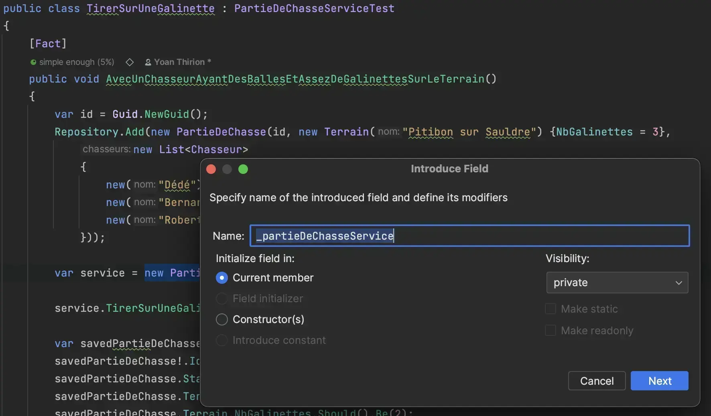
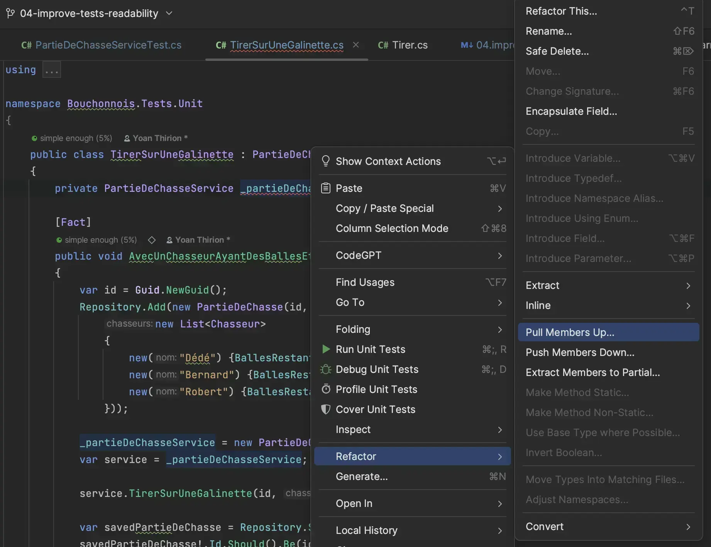
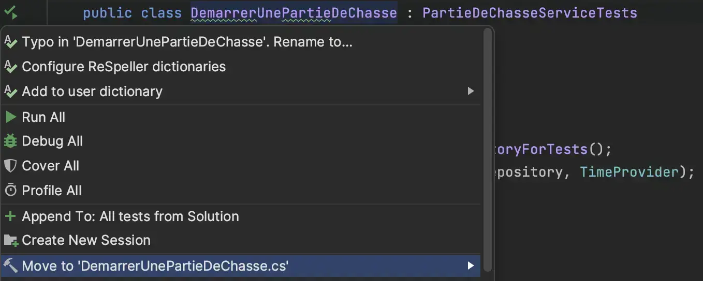
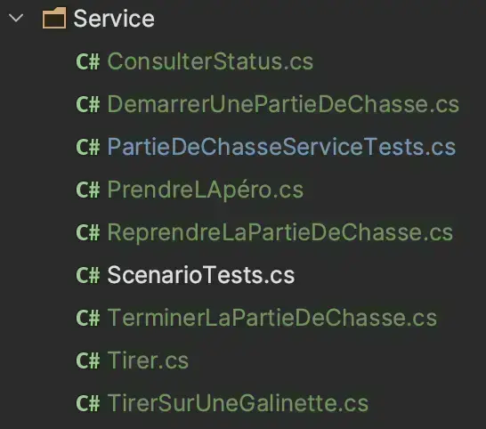
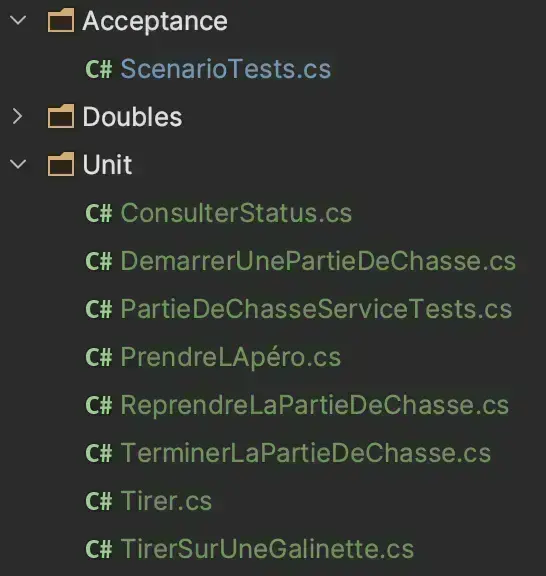
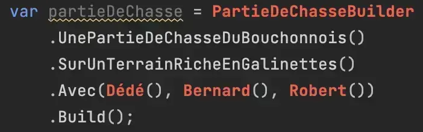
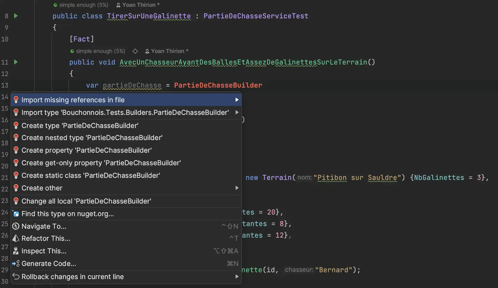
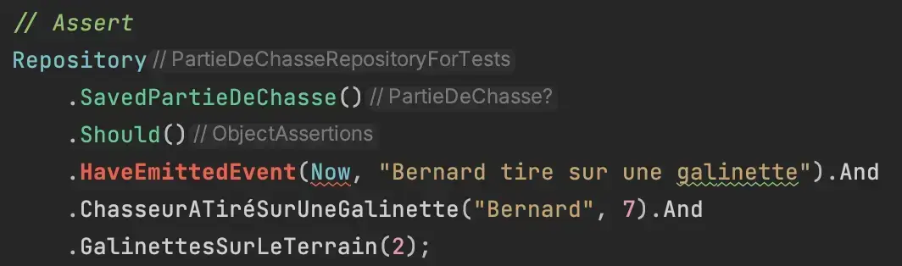
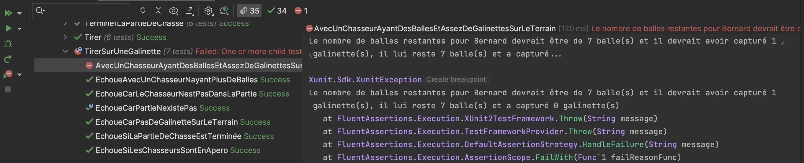

# Histoire 2 - Le bon test, on le lit
Durant cette étape :
- Splitter la classe de tests `PartieDeChasseServiceTests`
- Introduire des [`Test Data Builders`](https://xtrem-tdd.netlify.app/Flavours/Testing/test-data-builders) + des [`Object Mothers`](http://www.natpryce.com/articles/000714.html)
- Remplacer les blocs d'assertions par des méthodes d'extension métier
- Mesurer les limites d'un DSL `Given` / `When` / `Then`

Point de départ : le fichier tel que laissé par l'Histoire 1. Les mutants sont tués, `Events` est vérifié partout via un `AssertLastEvent` mutualisé au niveau de la classe englobante, le temps est figé (`TimeProvider`) - mais la classe reste une seule et même méga-classe de `848+` lignes :

```csharp
public class PartieDeChasseServiceTests
{
    private static readonly DateTime Now = new(2024, 6, 6, 14, 50, 45);
    private static readonly Func<DateTime> TimeProvider = () => Now;

    private static void AssertLastEvent(PartieDeChasse partieDeChasse, string expectedMessage)
    {
        Check.That(partieDeChasse.Events).HasSize(1);
        Check.That(partieDeChasse.Events[0]).IsEqualTo(new Event(Now, expectedMessage));
    }

    public class TirerSurUneGalinette
    {
        [Fact]
        public void AvecUnChasseurAyantDesBallesEtAssezDeGalinettesSurLeTerrain()
        {
            var id = Guid.NewGuid();
            var repository = new PartieDeChasseRepositoryForTests();

            repository.Add(new PartieDeChasse(id, new Terrain("Pitibon sur Sauldre") {NbGalinettes = 3},
            [
                new("Dédé") { BallesRestantes = 20 },
                new("Bernard") { BallesRestantes = 8 },
                new("Robert") { BallesRestantes = 12 }
            ]));

            var service = new PartieDeChasseService(repository, TimeProvider);

            service.TirerSurUneGalinette(id, "Bernard");

            var savedPartieDeChasse = repository.SavedPartieDeChasse();
            Check.That(savedPartieDeChasse!.Id).IsEqualTo(id);
            Check.That(savedPartieDeChasse.Status).IsEqualTo(PartieStatus.EnCours);
            Check.That(savedPartieDeChasse.Terrain.Nom).IsEqualTo("Pitibon sur Sauldre");
            Check.That(savedPartieDeChasse.Terrain.NbGalinettes).IsEqualTo(2);
            Check.That(savedPartieDeChasse.Chasseurs).HasSize(3);
            Check.That(savedPartieDeChasse.Chasseurs[0].Nom).IsEqualTo("Dédé");
            Check.That(savedPartieDeChasse.Chasseurs[0].BallesRestantes).IsEqualTo(20);
            Check.That(savedPartieDeChasse.Chasseurs[0].NbGalinettes).IsEqualTo(0);
            Check.That(savedPartieDeChasse.Chasseurs[1].Nom).IsEqualTo("Bernard");
            Check.That(savedPartieDeChasse.Chasseurs[1].BallesRestantes).IsEqualTo(7);
            Check.That(savedPartieDeChasse.Chasseurs[1].NbGalinettes).IsEqualTo(1);
            Check.That(savedPartieDeChasse.Chasseurs[2].Nom).IsEqualTo("Robert");
            Check.That(savedPartieDeChasse.Chasseurs[2].BallesRestantes).IsEqualTo(12);
            Check.That(savedPartieDeChasse.Chasseurs[2].NbGalinettes).IsEqualTo(0);

            AssertLastEvent(savedPartieDeChasse, "Bernard tire sur une galinette");
        }
        ...
    }
}
```

## Splitter la classe de tests
On commence par déplacer chaque classe imbriquée (`DemarrerUnePartieDeChasse`, `TirerSurUneGalinette`, `Tirer`, `PrendreLApéro`, `ReprendreLaPartieDeChasse`, `TerminerLaPartieDeChasse`, `ConsulterStatus`) à l'extérieur de `PartieDeChasseServiceTests`, chacune héritant d'une classe de base abstraite qui centralise ce qui est commun. `Now`, `TimeProvider` et `AssertLastEvent` existent déjà (Histoire 1) : on les rend simplement `protected` pour qu'ils restent accessibles à toutes les classes filles, plutôt que de les réécrire :

```csharp
public abstract class PartieDeChasseServiceTest
{
    protected static readonly DateTime Now = new(2024, 6, 6, 14, 50, 45);
    protected static readonly Func<DateTime> TimeProvider = () => Now;

    protected readonly PartieDeChasseRepositoryForTests Repository;
    protected readonly PartieDeChasseService PartieDeChasseService;

    protected PartieDeChasseServiceTest()
    {
        Repository = new PartieDeChasseRepositoryForTests();
        PartieDeChasseService = new PartieDeChasseService(Repository, TimeProvider);
    }

    protected static void AssertLastEvent(PartieDeChasse partieDeChasse, string expectedMessage)
    {
        Check.That(partieDeChasse.Events).HasSize(1);
        Check.That(partieDeChasse.Events[0]).IsEqualTo(new Event(Now, expectedMessage));
    }
}

public class TirerSurUneGalinette : PartieDeChasseServiceTest
{
    [Fact]
    public void AvecUnChasseurAyantDesBallesEtAssezDeGalinettesSurLeTerrain()
    {
        var id = Guid.NewGuid();
        Repository.Add(new PartieDeChasse(id, new Terrain("Pitibon sur Sauldre") {NbGalinettes = 3},
        [
            new("Dédé") { BallesRestantes = 20 },
            new("Bernard") { BallesRestantes = 8 },
            new("Robert") { BallesRestantes = 12 }
        ]));

        PartieDeChasseService.TirerSurUneGalinette(id, "Bernard");
        ...
        AssertLastEvent(Repository.SavedPartieDeChasse()!, "Bernard tire sur une galinette");
    }
}
```

On centralise (extract field, puis pull up member) :




Chaque classe part ensuite `safe` dans son propre fichier :



On se retrouve avec une hiérarchie qui reflète directement les cas d'usage du `Service` :



🔵 `ScenarioTests.cs` ne ressemble à aucun des autres fichiers : c'est un test de bout en bout qui rejoue une partie complète, pas un test unitaire sur un seul comportement. On en profite pour physiquement séparer `Unit/` et `Acceptance/` :



## Introduire un `Test Data Builder`
On identifie, dans le brouhaha de l'`Arrange`, ce qui compte vraiment pour le test : le nombre de galinettes sur le terrain et les chasseurs présents. On écrit d'abord, en mots, ce qu'on voudrait pouvoir écrire :

```csharp
var partieDeChasse = UnePartieDeChasseDuBouchonnois()
    .SurUnTerrainRicheEnGalinettes()
    .Avec(Dédé(), Bernard(), Robert())
    .Build();
```



Puis on génère les classes correspondantes depuis l'IDE ([`Generate Code From Usage`](https://xtrem-tdd.netlify.app/Flavours/generate-code-from-usage)) :



```csharp
// Bouchonnois.Tests.Builders
public class PartieDeChasseBuilder
{
    private int _nbGalinettes = 3;
    private PartieStatus _status = PartieStatus.EnCours;
    private ChasseurBuilder[] _chasseurs = [];
    private List<Event>? _historique;

    public static PartieDeChasseBuilder UnePartieDeChasseDuBouchonnois() => new();

    public PartieDeChasseBuilder SurUnTerrainRicheEnGalinettes(int nbGalinettes = 3)
    {
        _nbGalinettes = nbGalinettes;
        return this;
    }

    public PartieDeChasseBuilder SurUnTerrainSansGalinettes()
    {
        _nbGalinettes = 0;
        return this;
    }

    public PartieDeChasseBuilder Avec(params ChasseurBuilder[] chasseurs)
    {
        _chasseurs = chasseurs;
        return this;
    }

    public PartieDeChasseBuilder EnPleinApéro()
    {
        _status = PartieStatus.Apéro;
        return this;
    }

    public PartieDeChasseBuilder Terminée()
    {
        _status = PartieStatus.Terminée;
        return this;
    }

    // Pour les tests de ConsulterStatus, qui rejouent un historique d'événements plutôt qu'un état
    public PartieDeChasseBuilder AvecCommeHistorique(params Event[] events)
    {
        _historique = events.ToList();
        return this;
    }

    public PartieDeChasse Build()
    {
        var terrain = new Terrain("Pitibon sur Sauldre") { NbGalinettes = _nbGalinettes };
        var chasseurs = _chasseurs.Select(c => c.Build()).ToList();

        return _historique is not null
            ? new PartieDeChasse(Guid.NewGuid(), terrain, chasseurs, _historique)
            : new PartieDeChasse(Guid.NewGuid(), terrain, chasseurs, _status);
    }
}
```

On combine avec un `ChasseurBuilder`, qui mélange `Builder` et `Object Mother` (les 3 chasseurs "connus" du fichier de tests) :

```csharp
public class ChasseurBuilder
{
    private readonly string _nom;
    private int _ballesRestantes;
    private int _nbGalinettes;

    private ChasseurBuilder(string nom, int ballesRestantes)
    {
        _nom = nom;
        _ballesRestantes = ballesRestantes;
    }

    // Object Mothers
    public static ChasseurBuilder Dédé() => new("Dédé", ballesRestantes: 20);
    public static ChasseurBuilder Bernard() => new("Bernard", ballesRestantes: 8);
    public static ChasseurBuilder Robert() => new("Robert", ballesRestantes: 12);

    public ChasseurBuilder SansBalles()
    {
        _ballesRestantes = 0;
        return this;
    }

    public ChasseurBuilder AyantDéjàCapturé(int nbGalinettes)
    {
        _nbGalinettes = nbGalinettes;
        return this;
    }

    public Chasseur Build() => new(_nom) { BallesRestantes = _ballesRestantes, NbGalinettes = _nbGalinettes };
}
```

Le test devient :

```csharp
[Fact]
public void AvecUnChasseurAyantDesBallesEtAssezDeGalinettesSurLeTerrain()
{
    var partieDeChasse = UnePartieDeChasseDuBouchonnois()
        .SurUnTerrainRicheEnGalinettes()
        .Avec(Dédé(), Bernard(), Robert())
        .Build();

    Repository.Add(partieDeChasse);
    PartieDeChasseService.TirerSurUneGalinette(partieDeChasse.Id, "Bernard");

    var savedPartieDeChasse = Repository.SavedPartieDeChasse();
    Check.That(savedPartieDeChasse!.Id).IsEqualTo(partieDeChasse.Id);
    Check.That(savedPartieDeChasse.Status).IsEqualTo(PartieStatus.EnCours);
    Check.That(savedPartieDeChasse.Terrain.Nom).IsEqualTo("Pitibon sur Sauldre");
    Check.That(savedPartieDeChasse.Terrain.NbGalinettes).IsEqualTo(2);
    Check.That(savedPartieDeChasse.Chasseurs).HasSize(3);
    ...
}
```

`Avec` ce n'est pas fini : le `new Guid()`, la répétition de `Repository.Add`, et les 12 lignes d'assertions sont encore là. On simplifie l'`Arrange` avec une méthode `AvecUnePartieDeChasseExistante` sur la classe de base :

```csharp
protected PartieDeChasse AvecUnePartieDeChasseExistante(PartieDeChasseBuilder builder)
{
    var partieDeChasse = builder.Build();
    Repository.Add(partieDeChasse);
    return partieDeChasse;
}
```

## Écrire des assertions qui parlent le métier
`AssertLastEvent` était déjà la bonne intuition - une méthode statique qui cache 2 `Check.That` derrière une phrase métier. Le problème, c'est qu'elle est seule au milieu de 12 lignes de `Check.That` bruts sur `Terrain` et `Chasseurs`. On généralise l'idée au reste du bloc.

Plutôt que de plonger dans l'API d'extensibilité interne de `NFluent` (`ICheck<T>`, `ExecuteCheck`, ...), on écrit de simples **méthodes d'extension sur `PartieDeChasse`**, qui encapsulent en interne les `Check.That` nécessaires. C'est du C# ordinaire, ça se lit sans connaître `NFluent`, et ça reste testable comme n'importe quelle méthode.

On identifie d'abord ce qu'on veut pouvoir écrire :



Premier jet, en anglais, avec le préfixe `Should` par réflexe (c'est celui de `FluentAssertions`, qu'on a l'habitude de croiser) :

```csharp
savedPartieDeChasse.ShouldHaveChasseurWith("Bernard", ballesRestantes: 7, galinettes: 1);
savedPartieDeChasse.ShouldHaveGalinettesOnTerrain(2);
savedPartieDeChasse.ShouldHaveEmittedEvent(Now, "Bernard tire sur une galinette");
```

C'est déjà nettement plus lisible qu'un bloc de `Check.That`. Mais `Should` / `Have` restent du vocabulaire de testeur - le genre de mot qu'on trouve dans la documentation d'une librairie d'assertion, jamais dans la bouche d'un chasseur du Bouchonnois. On renomme pour que chaque méthode se lise comme une affirmation sur l'état de la `PartieDeChasse`, pas comme une case à cocher :

```csharp
// Bouchonnois.Tests.Assertions
// Remplace le AssertLastEvent statique de l'Histoire 1 : même vérification, mais découvrable
// directement en autocomplete depuis `partieDeChasse.` et chaînable avec les autres assertions
public static class PartieDeChasseAssertions
{
    // On renvoie `partieDeChasse` pour pouvoir chaîner plusieurs assertions sur le même objet
    public static PartieDeChasse AÉmisLÉvénement(
        this PartieDeChasse partieDeChasse,
        DateTime expectedTime,
        string expectedMessage)
    {
        Check.That(partieDeChasse.Events).HasSize(1);
        Check.That(partieDeChasse.Events[0]).IsEqualTo(new Event(expectedTime, expectedMessage));
        return partieDeChasse;
    }

    public static PartieDeChasse ContientLeChasseurAvec(
        this PartieDeChasse partieDeChasse,
        string nom,
        int ballesRestantes,
        int galinettes)
    {
        var chasseur = partieDeChasse.Chasseurs.Single(c => c.Nom == nom);
        Check.That(chasseur.BallesRestantes).IsEqualTo(ballesRestantes);
        Check.That(chasseur.NbGalinettes).IsEqualTo(galinettes);
        return partieDeChasse;
    }

    public static PartieDeChasse ContientLesGalinettes(this PartieDeChasse partieDeChasse, int nbGalinettes)
    {
        Check.That(partieDeChasse.Terrain.NbGalinettes).IsEqualTo(nbGalinettes);
        return partieDeChasse;
    }

    public static PartieDeChasse ALeStatus(this PartieDeChasse partieDeChasse, PartieStatus expected)
    {
        Check.That(partieDeChasse.Status).IsEqualTo(expected);
        return partieDeChasse;
    }
}
```

Le test se réduit à ce qui compte réellement pour ce comportement :

```csharp
[Fact]
public void AvecUnChasseurAyantDesBallesEtAssezDeGalinettesSurLeTerrain()
{
    var partieDeChasse = AvecUnePartieDeChasseExistante(
        UnePartieDeChasseDuBouchonnois()
            .SurUnTerrainRicheEnGalinettes()
            .Avec(Dédé(), Bernard(), Robert())
    );

    PartieDeChasseService.TirerSurUneGalinette(partieDeChasse.Id, "Bernard");

    Repository.SavedPartieDeChasse()!
        .ContientLeChasseurAvec("Bernard", ballesRestantes: 7, galinettes: 1)
        .ContientLesGalinettes(2)
        .AÉmisLÉvénement(Now, "Bernard tire sur une galinette");
}
```

33 lignes -> 8 lignes, et le "1 balle en moins, 1 galinette de plus pour Bernard, 1 de moins sur le terrain" saute maintenant aux yeux. Chaînées, ces trois lignes se lisent comme une phrase : *"la partie de chasse contient le chasseur Bernard avec 7 balles et 1 galinette, contient 2 galinettes sur le terrain, et a émis l'événement..."* On comprend le changement d'état attendu sans repasser par la case traduction technique.

Ce n'est pas qu'une question de goût. C'est le nom de la méthode qui apparaît dans le message d'échec quand le test devient rouge :

```
Bouchonnois.Tests.Unit.Service.TirerSurUneGalinette.AvecUnChasseurAyantDesBallesEtAssezDeGalinettesSurLeTerrain
  at PartieDeChasseAssertions.ContientLeChasseurAvec(...)
```

`ContientLeChasseurAvec` qui échoue te dit, dans la langue du métier et sans détour, quel fait attendu sur la partie de chasse ne s'est pas produit. `ShouldHaveChasseurWith` aurait dit la même chose, mais dans un vocabulaire qu'il faut d'abord retraduire mentalement en "ah, ça doit vouloir dire que Bernard a le mauvais nombre de balles ou de galinettes". Et un `Check.That(savedPartieDeChasse.Chasseurs[1].BallesRestantes).IsEqualTo(7)` qui échoue ne dit rien du tout du métier - juste qu'un entier ne vaut pas un autre entier, à toi de reconstituer le contexte. Cette différence est minime en train de lire le test tranquillement ; elle devient significative en pleine CI, sous pression, à essayer de comprendre en 10 secondes pourquoi le build est cassé. Moins de traduction mentale entre l'échec et sa compréhension, c'est moins de charge cognitive exactement au moment où on en a le moins à revendre.

### On vérifie la fiabilité de ces nouveaux outils
Les `Builders` et les assertions vont devenir le socle de tous les tests du fichier : s'ils mentent, c'est toute la suite de tests qui en hérite silencieusement. On introduit un mutant à la main dans `PartieDeChasseService`, exactement comme en Histoire 1 :

```csharp
chasseurQuiTire.BallesRestantes--;
// On commente l'incrément du nombre de galinettes chez notre chasseur
//chasseurQuiTire.NbGalinettes++;
partieDeChasse.Terrain.NbGalinettes--;
partieDeChasse.Events.Add(new Event(_timeProvider(), $"{chasseur} tire sur une galinette"));
```

Le test échoue bien, l'assertion détecte le mutant :



On répète le processus avec quelques mutants supplémentaires pour se rassurer, puis on propage `Builders` + assertions à tous les tests voisins (`Tirer`, `PrendreLApéro`, `ReprendreLaPartieDeChasse`, `TerminerLaPartieDeChasse`).

## Aller plus loin : un DSL `Given` / `When` / `Then`
On peut structurer le test autour de 3 étapes explicites :

```csharp
protected void Given(PartieDeChasse partieDeChasseExistante) => _partieDeChasseId = partieDeChasseExistante.Id;
protected void When(Action<Guid> action) => _quand = action;

protected void Then(Action<PartieDeChasse> assertions)
{
    _quand!(_partieDeChasseId);
    assertions(Repository.SavedPartieDeChasse()!);
}
```

```csharp
[Fact]
public void AvecUnChasseurAyantDesBallesEtAssezDeGalinettesSurLeTerrain()
{
    Given(
        AvecUnePartieDeChasseExistante(
            UnePartieDeChasseDuBouchonnois()
                .SurUnTerrainRicheEnGalinettes()
                .Avec(Dédé(), Bernard(), Robert())
        ));

    When(id => PartieDeChasseService.TirerSurUneGalinette(id, "Bernard"));

    Then(savedPartieDeChasse =>
    {
        savedPartieDeChasse.ContientLeChasseurAvec("Bernard", ballesRestantes: 7, galinettes: 1);
        savedPartieDeChasse.ContientLesGalinettes(2);
        savedPartieDeChasse.AÉmisLÉvénement(Now, "Bernard tire sur une galinette");
    });
}
```

C'est lisible - presque du `gherkin`. Mais avant de le généraliser à tout le fichier, regarde ses limites :
- **Les cas d'erreur ne rentrent pas dans le moule.** Il faut une variante `ThenThrow<TException>` qui exécute `_quand` dans un `Check.ThatCode(...)`, ce qui double le vocabulaire du DSL (`Then` / `ThenThrow`) pour un gain de lisibilité marginal sur des tests déjà courts (`EchoueAvecUnChasseurNayantPlusDeBalles`).
- **Les cas où l'action retourne une valeur ne rentrent pas non plus.** `TerminerLaPartie` retourne le nom du vainqueur : `Action<Guid>` ne suffit plus, il faut un second chemin (`Func<Guid, string>` + un `Then` dédié), et le DSL commence à avoir plusieurs implémentations qui se chevauchent.
- **Le debug devient indirect.** Quand `Then` échoue, la stack trace pointe dans le DSL, pas dans le test lui-même - il faut remonter d'un niveau pour comprendre ce qui a vraiment cassé.
- **C'est un outil de plus à maintenir.** Comme les `Builders` et les assertions, ce DSL doit être fiable et documenté ; c'est justifié quand des dizaines de tests partagent la même forme (ce qui est le cas ici), beaucoup moins pour un fichier de 3 tests.

Pour ce fichier - beaucoup de tests, une forme très répétitive (`Arrange` / `Act` / `Assert` identique) - le DSL se justifie. Sur un fichier avec 3-4 tests hétérogènes, la version `Given(...)` sans `Then`/`ThenThrow` séparé, voire un simple `Arrange` / `Act` / `Assert` avec `Builders` + assertions métier, suffit largement.

## Reflect
Compare le test du début et sa version finale :

```csharp
// Avant (fin de l'Histoire 1) : 33 lignes, signal noyé dans le bruit -
// les mutants sont morts, mais AssertLastEvent est perdu au milieu de 12 Check.That bruts
[Fact]
public void AvecUnChasseurAyantDesBallesEtAssezDeGalinettesSurLeTerrain()
{
    var id = Guid.NewGuid();
    var repository = new PartieDeChasseRepositoryForTests();

    repository.Add(new PartieDeChasse(id, new Terrain("Pitibon sur Sauldre") {NbGalinettes = 3},
    [
        new("Dédé") { BallesRestantes = 20 },
        new("Bernard") { BallesRestantes = 8 },
        new("Robert") { BallesRestantes = 12 }
    ]));

    var service = new PartieDeChasseService(repository, TimeProvider);
    service.TirerSurUneGalinette(id, "Bernard");

    var savedPartieDeChasse = repository.SavedPartieDeChasse();
    Check.That(savedPartieDeChasse!.Id).IsEqualTo(id);
    Check.That(savedPartieDeChasse.Status).IsEqualTo(PartieStatus.EnCours);
    Check.That(savedPartieDeChasse.Terrain.Nom).IsEqualTo("Pitibon sur Sauldre");
    Check.That(savedPartieDeChasse.Terrain.NbGalinettes).IsEqualTo(2);
    Check.That(savedPartieDeChasse.Chasseurs).HasSize(3);
    Check.That(savedPartieDeChasse.Chasseurs[0].Nom).IsEqualTo("Dédé");
    Check.That(savedPartieDeChasse.Chasseurs[0].BallesRestantes).IsEqualTo(20);
    Check.That(savedPartieDeChasse.Chasseurs[0].NbGalinettes).IsEqualTo(0);
    Check.That(savedPartieDeChasse.Chasseurs[1].Nom).IsEqualTo("Bernard");
    Check.That(savedPartieDeChasse.Chasseurs[1].BallesRestantes).IsEqualTo(7);
    Check.That(savedPartieDeChasse.Chasseurs[1].NbGalinettes).IsEqualTo(1);
    Check.That(savedPartieDeChasse.Chasseurs[2].Nom).IsEqualTo("Robert");
    Check.That(savedPartieDeChasse.Chasseurs[2].BallesRestantes).IsEqualTo(12);
    Check.That(savedPartieDeChasse.Chasseurs[2].NbGalinettes).IsEqualTo(0);

    AssertLastEvent(savedPartieDeChasse, "Bernard tire sur une galinette");
}

// Après (Histoire 2) : le signal, rien que le signal - et toujours aucun mutant qui survit
[Fact]
public void AvecUnChasseurAyantDesBallesEtAssezDeGalinettesSurLeTerrain()
{
    var partieDeChasse = AvecUnePartieDeChasseExistante(
        UnePartieDeChasseDuBouchonnois()
            .SurUnTerrainRicheEnGalinettes()
            .Avec(Dédé(), Bernard(), Robert())
    );

    PartieDeChasseService.TirerSurUneGalinette(partieDeChasse.Id, "Bernard");

    Repository.SavedPartieDeChasse()!
        .ContientLeChasseurAvec("Bernard", ballesRestantes: 7, galinettes: 1)
        .ContientLesGalinettes(2)
        .AÉmisLÉvénement(Now, "Bernard tire sur une galinette");
}
```

Même comportement vérifié (`Events` compris - Histoire 1 n'a pas été perdue en route), même robustesse aux mutants - mais un seul se lit en 5 secondes, dans la langue du métier plutôt que dans celle du framework de test.


## Le résultat dans le code
Cette étape (sans le DSL `Given` / `When` / `Then`, laissé en exercice) est appliquée dans `src/Bouchonnois.Tests/` :
- `Builders/PartieDeChasseBuilder.cs` et `Builders/ChasseurBuilder.cs`
- `Assertions/PartieDeChasseAssertions.cs` (`ALeStatus`, `ContientLesGalinettes`, `ContientLeChasseurAvec`, `AÉmisLÉvénement`)
- `Unit/Service/*.cs` (une classe de test par comportement, héritant de `PartieDeChasseServiceTest`)
- `Acceptance/ScenarioTests.cs` (déplacé hors de `Unit/`, seul test qui rejoue une partie de bout en bout)
