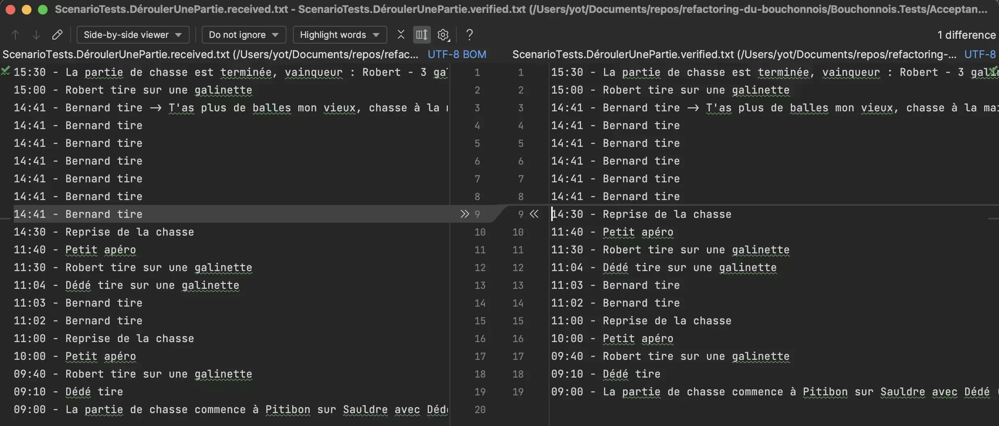
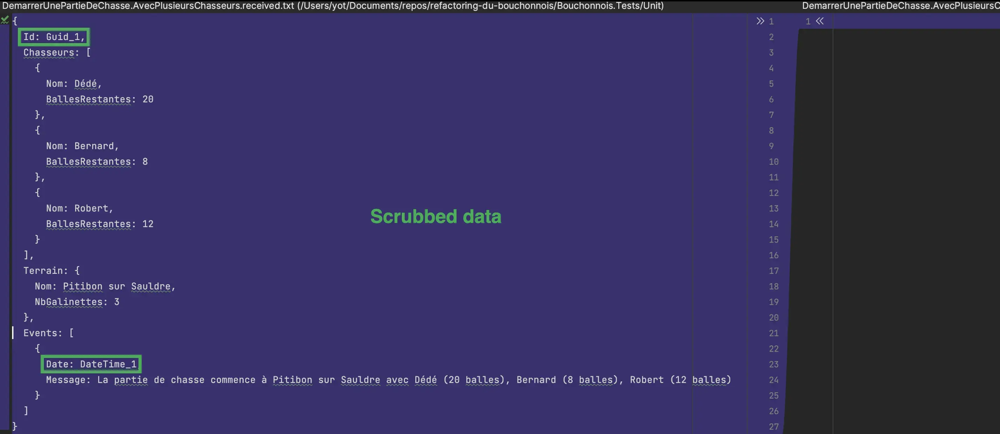
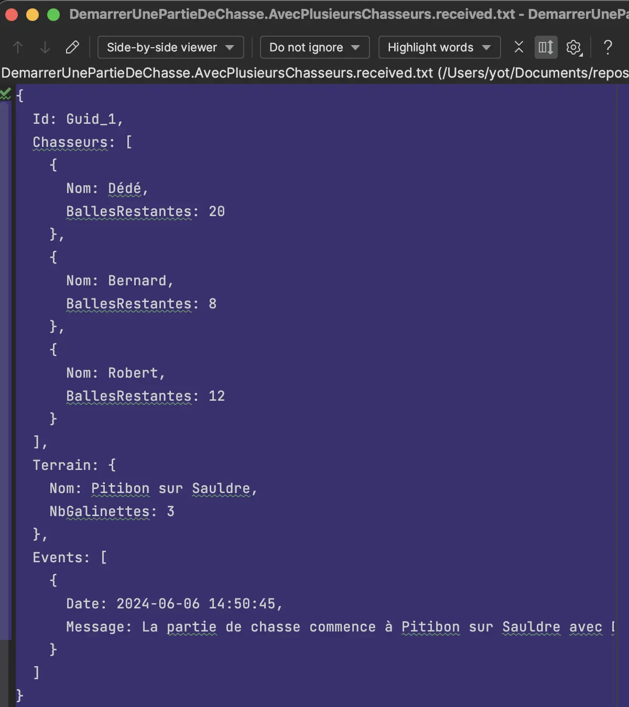
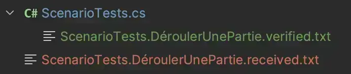
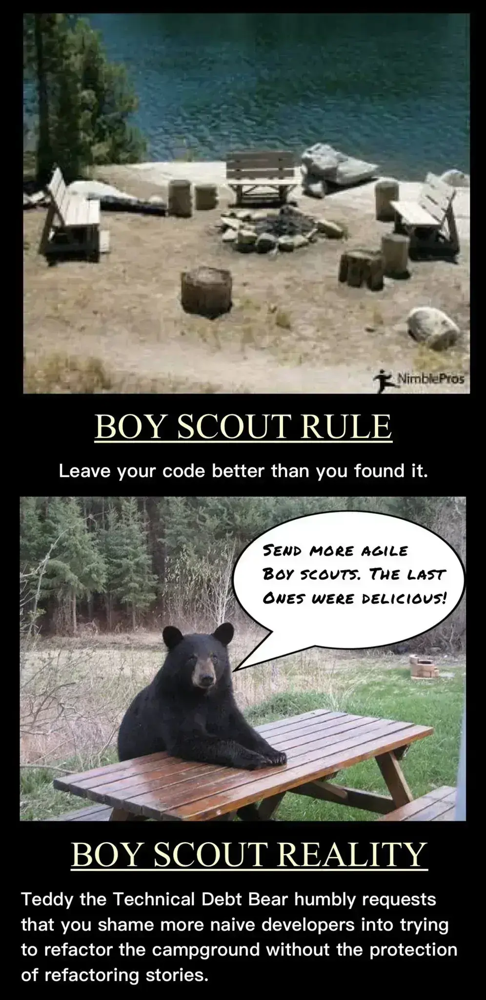
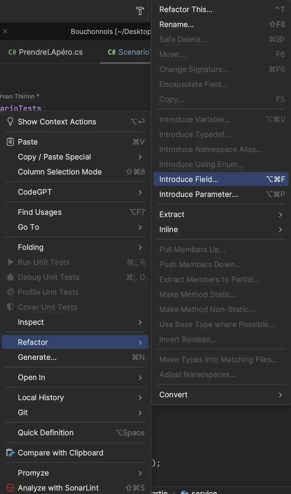
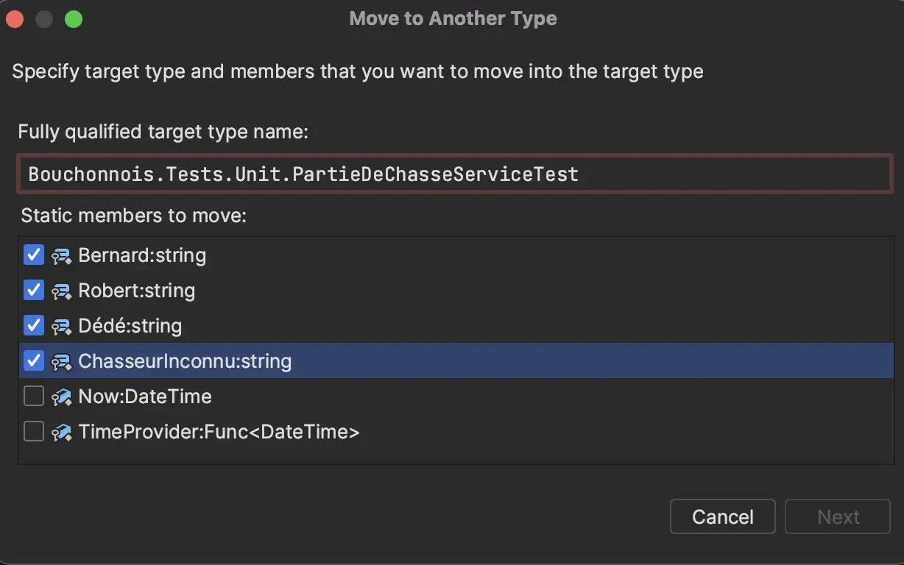
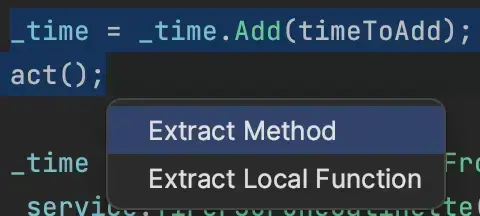

# Histoire 3 - Le bon test, parfois, ne s'écrit pas à la main
Durant cette étape :
- Identifier les tests dont l'assertion porte sur une structure ou une trace entière plutôt que sur quelques faits ciblés
- Les transformer en [`Approval Tests`](https://github.com/ythirion/approval-testing-kata#2-approval-testing) avec [`Verify`](https://github.com/VerifyTests/Verify)
- Nettoyer ce qui reste (`Boy Scout Rule`) une fois le test fiable

## Identification des tests
Dans `PartieDeChasseServiceTests.cs` / `ScenarioTests.cs`, trois tests sont de bons candidats :
- `DemarrerUnePartieDeChasse.AvecPlusieursChasseurs` : 13 lignes de `Check.That` pour vérifier l'intégralité de la `PartieDeChasse` sauvegardée
- `ConsulterStatus.QuandLaPartieVientDeDémarrer` / `QuandLaPartieEstTerminée` : la sortie textuelle complète de `ConsulterStatus`
- `ScenarioTests.DéroulerUnePartie` : un scénario de bout en bout, validé par une seule `string` de 19 lignes recopiée depuis une exécution passée

Dans les trois cas, le point commun est le même : ce qui est vérifié n'est pas "2-3 faits", c'est **tout**. Les assertions métier de l'Histoire 2 ne changeraient rien au problème - elles ne feraient que renommer la même liste de vérifications ligne par ligne.

## Ajouter la dépendance
```bash
dotnet add package Verify.xUnit
```

## Refactorer `DemarrerUnePartieDeChasse.AvecPlusieursChasseurs`
On transforme le test en `Approval Test` :
- Ajout de l'annotation `[UsesVerify]` sur la classe de test
- La méthode de test renvoie désormais un `Task`
- L'assertion devient un `return Verify(...)`

```csharp
[UsesVerify]
public class DemarrerUnePartieDeChasse : PartieDeChasseServiceTest
{
    [Fact]
    public Task AvecPlusieursChasseurs()
    {
        var repository = new PartieDeChasseRepositoryForTests();
        var service = new PartieDeChasseService(repository, () => DateTime.Now);
        var chasseurs = new List<(string, int)>
        {
            ("Dédé", 20),
            ("Bernard", 8),
            ("Robert", 12)
        };

        service.Demarrer(("Pitibon sur Sauldre", 3), chasseurs);

        return Verify(repository.SavedPartieDeChasse());
    }
}
```

Premier lancement : le fichier `DemarrerUnePartieDeChasse.AvecPlusieursChasseurs.verified.txt` n'existe pas encore, le test échoue, et l'outil de comparaison de fichiers configuré s'ouvre :



Le contenu proposé - la sortie réelle du test - ressemble à ceci une fois approuvé :

```text
{
  Id: Guid_1,
  Chasseurs: [
    {
      Nom: Dédé,
      BallesRestantes: 20
    },
    {
      Nom: Bernard,
      BallesRestantes: 8
    },
    {
      Nom: Robert,
      BallesRestantes: 12
    }
  ],
  Terrain: {
    Nom: Pitibon sur Sauldre,
    NbGalinettes: 3
  },
  Events: [
    {
      Date: DateTime_1,
      Message: La partie de chasse commence à Pitibon sur Sauldre avec Dédé (20 balles), Bernard (8 balles), Robert (12 balles)
    }
  ]
}
```

🔵 `Id` est un `Guid_1` et `Date` un `DateTime_1` : par défaut, `Verify` **scrube** (remplace par un placeholder stable) les valeurs non déterministes. C'est ce qui permet au fichier approuvé de rester stable d'un run à l'autre.

🔵 On perd cependant l'assertion qu'on avait avant sur l'horodatage exact. Si on veut la garder :

```csharp
return Verify(repository.SavedPartieDeChasse())
    .DontScrubDateTimes();
```

Le fichier approuvé contient alors la vraie date :



On peut désormais approuver le résultat :



### On vérifie que le test peut vraiment échouer
`Never trust a test you haven't seen fail` (Histoire 1) s'applique aussi ici. On modifie le fichier `.verified.txt` à la main (par exemple, on change `BallesRestantes: 20` en `BallesRestantes: 99`) et on relance :



Le test passe bien au rouge, avec le diff exact sous les yeux. On remet la valeur correcte, et on ajoute au `.gitignore` :

```text
# Verify
*.received.txt
```

Le fichier `*.received.txt` est la sortie produite à chaque run raté - jamais à committer, seul le `.verified.txt` (la référence approuvée) doit l'être.

## Refactorer `ConsulterStatus`
Même stratégie sur les deux tests de `ConsulterStatus` : on remplace le `Check.That(status).IsEqualTo("...")` par un `return Verify(service.ConsulterStatus(id)).DontScrubDateTimes()` (on garde les horodatages, ils sont au cœur de ce qu'on vérifie ici). Chaque test obtient son propre fichier `ConsulterStatus.QuandLaPartieVientDeDémarrer.verified.txt` / `ConsulterStatus.QuandLaPartieEstTerminée.verified.txt`, contenant exactement la sortie qu'on approuve.

## Refactorer `ScenarioTests.DéroulerUnePartie`
C'est ici que le gain est le plus net : la `string` de 19 lignes recopiée à la main disparaît complètement.

```csharp
[UsesVerify]
public class ScenarioTests
{
    [Fact]
    public Task DéroulerUnePartie()
    {
        var time = new DateTime(2024, 4, 25, 9, 0, 0);
        var repository = new PartieDeChasseRepositoryForTests();
        var service = new PartieDeChasseService(repository, () => time);
        var chasseurs = new List<(string, int)>
        {
            ("Dédé", 20),
            ("Bernard", 8),
            ("Robert", 12)
        };
        var id = service.Demarrer(("Pitibon sur Sauldre", 4), chasseurs);

        time = time.Add(TimeSpan.FromMinutes(10));
        service.Tirer(id, "Dédé");

        // ... les 17 autres actions du scénario, inchangées ...

        time = time.Add(TimeSpan.FromMinutes(30));
        service.TerminerLaPartie(id);

        return Verify(service.ConsulterStatus(id));
    }
}
```

Le test passe du premier coup 👌 - normal, on vient de capturer sa propre sortie actuelle. On le casse une nouvelle fois volontairement (fichier `.verified.txt` modifié à la main) pour confirmer qu'il détecte un vrai écart, exactement comme pour `AvecPlusieursChasseurs`.

## `Boy Scout Rule`
Le test passe, il est fiable - mais pas très lisible : beaucoup de duplication (`time = time.Add(...)` répété 19 fois), un `try / catch` vide pour le tir sans balle, une méthode de plus de 80 lignes. On nettoie, une petite étape à la fois.



### Extraction de champs
```csharp
[UsesVerify]
public class ScenarioTests
{
    private DateTime _time = new(2024, 4, 25, 9, 0, 0);
    private readonly PartieDeChasseRepositoryForTests _repository = new();
    private readonly PartieDeChasseService _service;

    public ScenarioTests()
    {
        _service = new PartieDeChasseService(_repository, () => _time);
    }
    ...
}
```



### Suppression des `string` en dur
On introduit un petit `Builder` dédié à la commande `Demarrer` (différent de `PartieDeChasseBuilder` de l'Histoire 2 : ici on construit les tuples attendus par `Demarrer`, pas un objet `PartieDeChasse` existant), et une classe de constantes pour les noms des chasseurs :

```csharp
// Bouchonnois.Tests.Builders
public class CommandBuilder
{
    private (string, int)[] _chasseurs = [];
    private int _nbGalinettes;

    public static CommandBuilder DémarrerUnePartieDeChasse() => new();

    public CommandBuilder Avec(params (string, int)[] chasseurs)
    {
        _chasseurs = chasseurs;
        return this;
    }

    public CommandBuilder SurUnTerrainRicheEnGalinettes(int nbGalinettes = 4)
    {
        _nbGalinettes = nbGalinettes;
        return this;
    }

    public List<(string nom, int nbBalles)> Chasseurs => _chasseurs.ToList();
    public (string nom, int nbGalinettes) Terrain => ("Pitibon sur Sauldre", _nbGalinettes);
}
```

```csharp
// Bouchonnois.Tests.Builders
public static class Chasseurs
{
    public const string Dédé = "Dédé";
    public const string Bernard = "Bernard";
    public const string Robert = "Robert";
    public const string ChasseurInconnu = "Chasseur inconnu";
}
```



```csharp
var command = DémarrerUnePartieDeChasse()
    .Avec((Chasseurs.Dédé, 20), (Chasseurs.Bernard, 8), (Chasseurs.Robert, 12))
    .SurUnTerrainRicheEnGalinettes();

var id = _service.Demarrer(command.Terrain, command.Chasseurs);
```

### Extraction de méthode : le motif "avance le temps, exécute, ignore l'exception"
Chaque étape du scénario répète le même motif :

```csharp
_time = _time.Add(TimeSpan.FromMinutes(30));
_service.TirerSurUneGalinette(id, Chasseurs.Robert);
```

On prépare l'extraction en décomposant :

```csharp
var timeToAdd = TimeSpan.FromMinutes(10);
var act = () => _service.Tirer(id, Chasseurs.Dédé);

_time = _time.Add(timeToAdd);
act();
```



Puis on l'utilise partout, `try / catch` compris (le tir sans balle attendu au milieu du scénario) :

```csharp
[UsesVerify]
public class ScenarioTests
{
    private DateTime _time = new(2024, 4, 25, 9, 0, 0);
    private readonly PartieDeChasseRepositoryForTests _repository = new();
    private readonly PartieDeChasseService _service;

    public ScenarioTests()
    {
        _service = new PartieDeChasseService(_repository, () => _time);
    }

    [Fact]
    public Task DéroulerUnePartie()
    {
        var command = DémarrerUnePartieDeChasse()
            .Avec((Chasseurs.Dédé, 20), (Chasseurs.Bernard, 8), (Chasseurs.Robert, 12))
            .SurUnTerrainRicheEnGalinettes();

        var id = _service.Demarrer(command.Terrain, command.Chasseurs);

        After(10.Minutes(), () => _service.Tirer(id, Chasseurs.Dédé));
        After(30.Minutes(), () => _service.TirerSurUneGalinette(id, Chasseurs.Robert));
        After(20.Minutes(), () => _service.PrendreLapéro(id));
        After(1.Hours(), () => _service.ReprendreLaPartie(id));
        // ... reste du scénario, une ligne par action ...
        After(30.Minutes(), () => _service.TerminerLaPartie(id));

        return Verify(_service.ConsulterStatus(id));
    }

    private void After(TimeSpan time, Action act)
    {
        _time = _time.Add(time);
        try
        {
            act();
        }
        catch
        {
            // le scénario contient volontairement un tir sans balle -> exception attendue, ignorée ici
        }
    }
}
```

À chaque étape de ce nettoyage, on relance le test : il reste vert, le fichier `.verified.txt` ne bouge pas d'un caractère - la preuve qu'on a changé la forme du test, jamais ce qu'il approuve.

## Reflect
- Le principal risque de l'Approval Testing, c'est d'approuver sans relire (*"rubber stamping"*) : le diff s'affiche, on clique "accepter" par réflexe parce que le test était rouge et qu'on veut qu'il redevienne vert. Sur `ScenarioTests`, ça reviendrait à valider un changement de comportement (un mauvais galinettes restantes, un message d'événement cassé) sans s'en rendre compte - exactement le mensonge que l'Histoire 1 nous a appris à traquer.
- Le `scrubbing` ne résout pas le non-déterminisme, il le rend juste inoffensif pour la comparaison : la vraie date/le vrai `Guid` sont toujours générés, seulement remplacés par un placeholder stable au moment de la comparaison. C'est un compromis délibéré, pas une solution au non-déterminisme lui-même (qu'on gère par ailleurs via le `TimeProvider` figé, depuis l'Histoire 1).
- Sur `AvecPlusieursChasseurs`, les deux techniques auraient pu marcher - le choix dépend surtout du nombre de faits vérifiés : 2-3 faits ciblés -> une assertion métier nommée reste plus explicite (le nom de la méthode dit ce qui est vérifié). Toute une structure ou une trace complète -> l'Approval Test évite d'écrire à la main une deuxième checklist aussi longue que la première.

## Le résultat dans le code
Cette étape est appliquée dans `src/Bouchonnois.Tests/` :
- `Unit/Service/DemarrerUnePartieDeChasse.cs` et `Unit/Service/ConsulterStatus.cs` (`[UsesVerify]`, un `.verified.txt` par test)
- `Acceptance/ScenarioTests.cs` (scénario nettoyé, toujours dans son propre dossier depuis l'Histoire 2)
- `.gitignore` : ajout de `*.received.txt`
