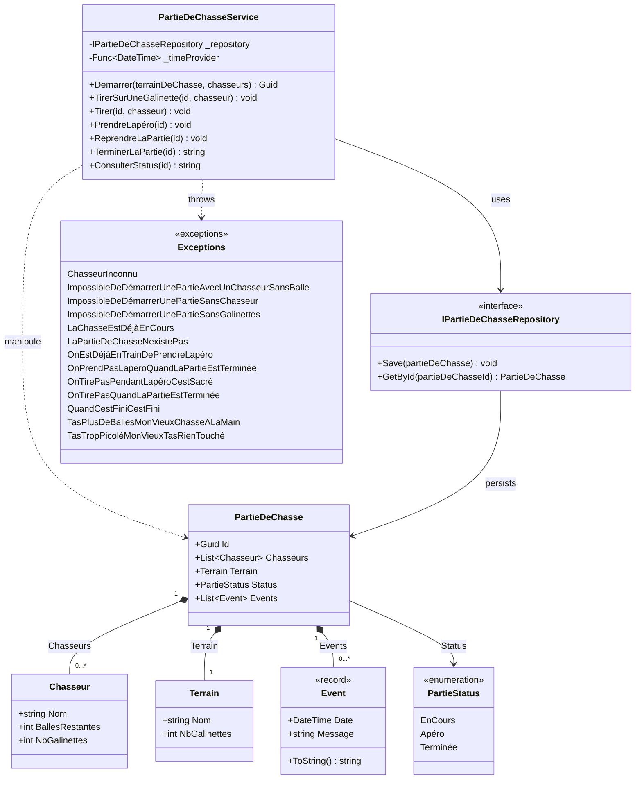

---
layout: section
---

<div class="flex items-center gap-16">

<div class="flex-1">

# Qui suis-je ?

<div class="accent-badge mb-6">Yoan Thirion</div>

- Responsable de la pédagogie - [école Coda Dijon](https://coda.school/)
- Software Crafter, Coach Agile, Juste un Dév
- GitHub : [@ythirion](https://github.com/ythirion)
- LinkedIn : [yoanthirion](https://www.linkedin.com/in/yoanthirion/)

</div>


</div>

---
layout: section
---

# Qui connait le Bouchonnois ?


---
layout: image
image: /quote-chasseurs.webp
---

---
codeSlide: true
---

<div class="flex items-center gap-12">

<div class="flex-1">


# Le contexte

> Nos valeureux chasseurs du Bouchonnois ont besoin de pouvoir gérer leurs parties de chasse.

Ils ont fait développer un système de gestion par l'entreprise `Toshiba`... et depuis, plus rien n'avance.

- Chaque nouvelle fonctionnalité prend plus de temps que la précédente
- L'entreprise parle d'une soi-disant `dette technique`, sans jamais l'expliquer

</div>


</div>

---
codeSlide: true
---

<div class="relative h-full flex items-center justify-center">


<a href="https://xtrem-tdd.netlify.app/Flavours/Practices/example-mapping" target="_blank" class="link-preview link-preview-sm absolute top-1 right-1">
  <div class="link-preview-title">Example Mapping</div>
  <div class="link-preview-url">xtrem-tdd.netlify.app/Flavours/Practices/example-mapping</div>
</a>

</div>

---
layout: section
---

<div class="flex items-center gap-12">

<div class="flex-1">

# Outside-in Code Review
- [ ] Technologies utilisées
- [ ] Compiler / exécuter le code : analyser les potentiels `Warning`
- [ ] Analyser la structure de la solution afin de comprendre l'architecture en place
- [ ] Regarder les dépendances afin de comprendre les interactions potentielles du système
- [ ] Calculer le `code coverage`
- [ ] Analyser le rapport d'analyse static de code
- [ ] Identifier s'il y a des [`hotspots`](https://understandlegacycode.com/blog/focus-refactoring-with-hotspots-analysis/) et où ils sont localisés

</div>
    <a href="https://canva.link/4b9mxwe0oxw67js" target="_blank">
        
    </a>
</div>

<!-- Libyear, Analyse comportementale de code, skill claude associée, C4 model, ... -->

---
layout: section
---

# Technologies utilisées

- `C#` / `.NET 10`
- `xUnit` + `NFluent`
- Coverage : `coverlet`
- Analyse statique de code : `SonarCloud`

---
layout: section
---

# Compiler


<div class="accent-badge mt-8">Aucun warning</div>

---
layout: section
---

# Architecture / Dépendances


---
codeSlide: true
---

<div class="h-full flex flex-col">

# Le code, en bref

<div class="mermaid-fit flex-1 min-h-0">



</div>

</div>

---
layout: section
---

# Calculer le code coverage

<div class="flex flex-col items-center gap-4">
  
  
</div>

---
layout: section
---

# Analyse static de code


---
layout: section
---


# Analyse static de code


---
layout: section
---

# Analyse comportementale de code


---
layout: section
---


<br/>
2 hostpots : PartieDeChasseService.cs, PartieDeChasseServiceTests.cs

---
codeSlide: true
---

# La complexité...

```csharp {all|27,34,39}{maxHeight:'380px'}
public void TirerSurUneGalinette(Guid id, string chasseur)
{
    var partieDeChasse = _repository.GetById(id);
    if (partieDeChasse == null)
    {
        throw new LaPartieDeChasseNexistePas();
    }
    if (partieDeChasse.Terrain.NbGalinettes != 0)
    {
        if (partieDeChasse.Status != PartieStatus.Apéro)
        {
            if (partieDeChasse.Status != PartieStatus.Terminée)
            {
                if (partieDeChasse.Chasseurs.Exists(c => c.Nom == chasseur))
                {
                    ...
                }
                else
                {
                    throw new ChasseurInconnu(chasseur);
                }
            }
            else
            {
                partieDeChasse.Events.Add(new Event(_timeProvider(), $"{chasseur} veut tirer -> On tire pas quand la partie est terminée"));
                _repository.Save(partieDeChasse);
                throw new OnTirePasQuandLaPartieEstTerminée();
            }
        }
        else
        {
            partieDeChasse.Events.Add(new Event(_timeProvider(), $"{chasseur} veut tirer -> On tire pas pendant l'apéro, c'est sacré !!!"));
            _repository.Save(partieDeChasse);
            throw new OnTirePasPendantLapéroCestSacré();
        }
    }
    else
    {
        throw new TasTropPicoléMonVieuxTasRienTouché();
    }
    _repository.Save(partieDeChasse);
}
```

---
layout: section
---

# Avant d'aller plus loin
Et si on faisait l'anatomie d'un test ?
Qu'est ce que vous associez à cela ?

---
layout: section
---


---
codeSlide: true
---

# Anatomie d'un test

```csharp {all|1|6-7|9-12|14-15|17-19}
public class AddANewComment
{
    private const string Author = "Les Inconnus";
    private const string AComment = "C'est exactement ça !!!";
    
    [Fact]
    public void In_An_Article_Include_Author_And_Text()
    {
        // Arrange
        var article = new Article(
            "Chasse = Un Art ?",
            "C'est sur que la chasse c'est un art, pour d'autres ça peut être la peinture, la musique, tout ça mais pour nous c'est la chasse quoi c'est un art…");
        
        // Act
        var updatedArticle = article.AddComment(Author, AComment);

        // Assert
        updatedArticle.IsRight.Should().BeTrue();
        AssertComment(updatedArticle.RightUnsafe().Comments.Head, Author, AComment);
    }
    ...
}   
```

---
layout: section
---
# Quelques histoires
Maintenant qu'on a une meilleure vue sur le code, appliquons les préceptes des meilleurs devs du Bouchonnois :

<div class="text-lg space-y-3 mt-4">

1. **Le bon test ne ment pas**
2. **Le bon test, on le lit**
3. **Le bon test, on le maintient**
4. **Le bon test, parfois, ne s'écrit pas à la main**
5. **Le bon test couvre ce que tu n'as pas pensé à tester**
6. **Le bon test protège l'architecture**

</div>

---
layout: image
image: /01.le-bon-test-ne-ment-pas/tests-dont-lie.webp
---

---
codeSlide: true
---

# Un test du Bouchonnois

```csharp {all|1|4|6-15|17-18|20-35}{maxHeight:'380px'}
public class TirerSurUneGalinette
{
    [Fact]
    public void AvecUnChasseurAyantDesBallesEtAssezDeGalinettesSurLeTerrain()
    {
        // Arrange
        var id = Guid.NewGuid();
        var repository = new PartieDeChasseRepositoryForTests();
        repository.Add(new PartieDeChasse(id, new Terrain("Pitibon sur Sauldre") {NbGalinettes = 3},
        [
            new("Dédé") { BallesRestantes = 20 },
            new("Bernard") { BallesRestantes = 8 },
            new("Robert") { BallesRestantes = 12 }
        ]));
        var service = new PartieDeChasseService(repository, () => DateTime.Now);
    
        // Act
        service.TirerSurUneGalinette(id, "Bernard");
    
        // Assert
        var savedPartieDeChasse = repository.SavedPartieDeChasse();
        Check.That(savedPartieDeChasse!.Id).IsEqualTo(id);
        Check.That(savedPartieDeChasse.Status).IsEqualTo(PartieStatus.EnCours);
        Check.That(savedPartieDeChasse.Terrain.Nom).IsEqualTo("Pitibon sur Sauldre");
        Check.That(savedPartieDeChasse.Terrain.NbGalinettes).IsEqualTo(2);
        Check.That(savedPartieDeChasse.Chasseurs).HasSize(3);
        Check.That(savedPartieDeChasse.Chasseurs[0].Nom).IsEqualTo("Dédé");
        Check.That(savedPartieDeChasse.Chasseurs[0].BallesRestantes).IsEqualTo(20);
        Check.That(savedPartieDeChasse.Chasseurs[0].NbGalinettes).IsEqualTo(0);
        Check.That(savedPartieDeChasse.Chasseurs[1].Nom).IsEqualTo("Bernard");
        Check.That(savedPartieDeChasse.Chasseurs[1].BallesRestantes).IsEqualTo(7);
        Check.That(savedPartieDeChasse.Chasseurs[1].NbGalinettes).IsEqualTo(1);
        Check.That(savedPartieDeChasse.Chasseurs[2].Nom).IsEqualTo("Robert");
        Check.That(savedPartieDeChasse.Chasseurs[2].BallesRestantes).IsEqualTo(12);
        Check.That(savedPartieDeChasse.Chasseurs[2].NbGalinettes).IsEqualTo(0);
    }
}
```

---
codeSlide: true
---

# Et le code de production qu'il exerce ?

```csharp
public void TirerSurUneGalinette(Guid id, string chasseur)
{
    ...
    chasseurQuiTire.BallesRestantes--;
    chasseurQuiTire.NbGalinettes++;
    partieDeChasse.Terrain.NbGalinettes--;
    partieDeChasse.Events.Add(new Event(_timeProvider(), $"{chasseur} tire sur une galinette"));
}
```

<div class="mt-8 text-lg">

4 lignes de comportement métier. **Combien sont réellement vérifiées** par le test précédent ?

</div>

---
layout: section
---

# Ce test ment

<div class="text-lg space-y-4 max-w-3xl">

Le test vérifie l'`Id`, le `Status`, le `Terrain`, et l'état des 3 `Chasseurs`... mais jamais `Events`.

`Events` reconstitue **tout l'historique** d'une partie de chasse. Si un événement disparaît, se duplique ou change de contenu, ce test ne le verra **jamais**.

<div class="accent-badge mt-4">Plus un test a l'air minutieux, plus il inspire confiance à tort</div>

</div>

---
layout: section
---

<div class="flex flex-col items-center gap-6 text-center">

# Quoi ?! Mais on a 100% de code coverage !

<div class="accent-badge">100% coverage sur tous les fichiers</div>

</div>

---
layout: section
---


---
codeSlide: true
---

# Code Coverage

> La couverture de code mesure quelle portion du code source est **exécutée** par la suite de tests.

```
Code Coverage (%) = ( Lignes exécutées par les tests / Lignes exécutables totales ) × 100
```

<div class="mt-6 space-y-2 text-lg">

- Une couverture **faible** (ex : 10%) prouve qu'on ne teste pas assez ✅
- Une couverture **élevée** (même 100%) ne prouve **pas** qu'on a de bons tests ❌

</div>

---
codeSlide: true
---

# Branch Coverage

La couverture de branches se concentre sur les structures de contrôle (`if`, `switch`) : combien de chemins sont traversés par au moins un test.

```
Branch Coverage (%) = ( Branches exécutées par au moins un test / Nombre total de branches ) × 100
```

```java
// 2 chemins possibles : length > 5 et length <= 5
// Un test sur un seul chemin = 50% de branch coverage
public static boolean isLong(String s) {
    return s.length() > 5;
}
```

<div class="mt-4 text-lg">1 test (`isLong("hello") == false`) → 100% de <strong>Code Coverage</strong>, seulement 50% de <strong>Branch Coverage</strong>.</div>

---
layout: statement
---

# Code Coverage : bon indicateur négatif, mauvais indicateur positif

<div class="accent-badge mt-6">Le coverage ne dit jamais si ce que tu as testé est bien testé</div>

---
codeSlide: true
---

<div class="flex items-center gap-12">

<div class="flex-1">

# Le Mutation Testing à la rescousse ?

Introduire volontairement un petit bug (un `mutant`) dans le code de production, puis relancer les tests.

```
Mutation Score (%) = ( Mutants tués / Mutants générés ) × 100
```

<div class="mt-6 space-y-2 text-lg">

- Un test échoue → le mutant est **tué** → le comportement est réellement vérifié
- Tous les tests passent → le mutant **survit** → aucun test ne vérifie ce comportement

</div>

</div>


</div>

---
layout: section
---

# Démo : mutation

<div class="text-lg space-y-3 max-w-2xl">

- On choisit une ligne du code de production
- On la modifie/supprime à la main - c'est notre `mutant`
- On relance la suite de tests

<div class="accent-badge mt-4">Les tests passent toujours : le mutant a survécu...</div>

</div>

---
layout: section
---

<div class="flex items-center gap-12">

<div class="flex-1">

# Stryker : trouve des mutants pour nous

```bash
dotnet tool install -g dotnet-stryker
```

```bash
cd src
dotnet stryker
```

</div>

<div class="flex flex-col items-center gap-4 flex-shrink-0 w-72">


<a href="https://stryker-mutator.io/docs/stryker-net/introduction/" target="_blank" class="link-preview w-full">
  <div class="link-preview-title">Stryker.NET</div>
  <div class="link-preview-url">stryker-mutator.io/docs/stryker-net</div>
</a>

</div>

</div>

---
layout: section
---

# Exemples de Mutators

<div class="flex flex-row items-center justify-center gap-4">
  
  
  
</div>

<a href="https://stryker-mutator.io/docs/stryker-net/mutations/" target="_blank" class="link-preview link-preview-sm mt-6 mx-auto w-fit">
  <div class="link-preview-title">Mutators</div>
  <div class="link-preview-url">stryker-mutator.io/docs/stryker-net/mutations</div>
</a>

---
layout: section
---

# Rapport de mutation


---
layout: section
---

# String mutation

<div class="flex flex-row items-center justify-center gap-4">
  
  
</div>

---
layout: section
---

# Removal / Statement mutation

<div class="flex flex-col items-center gap-4">
  
</div>

---
layout: section
---

# LinQ mutation


---
codeSlide: true
---

# Démo : tueur de mutant

```csharp {all|1-2|4-7}
private static readonly DateTime Now = new(2024, 6, 6, 14, 50, 45);
private static readonly Func<DateTime> TimeProvider = () => Now;

private static void AssertEventHasBeenEmitted(PartieDeChasse partieDeChasse, string expectedMessage)
{
    Check.That(partieDeChasse.Events).HasSize(1);
    Check.That(partieDeChasse.Events[0]).IsEqualTo(new Event(Now, expectedMessage));
}
```

<div class="mt-6 text-lg">On fige le temps, puis on vérifie le <strong>dernier événement métier</strong> plutôt que la seule absence d'exception.</div>

---
layout: image
image: /01.le-bon-test-ne-ment-pas/a-few-minutes-later.webp
---

---
layout: section
---

# Plus de mutants !


---
layout: statement
---

# Merci !

Des questions ?

<div class="accent-badge mt-6">#sharingiscaring</div>

---
layout: statement
---

# "Never trust a test you haven't seen fail."

Vladimir Khorikov
