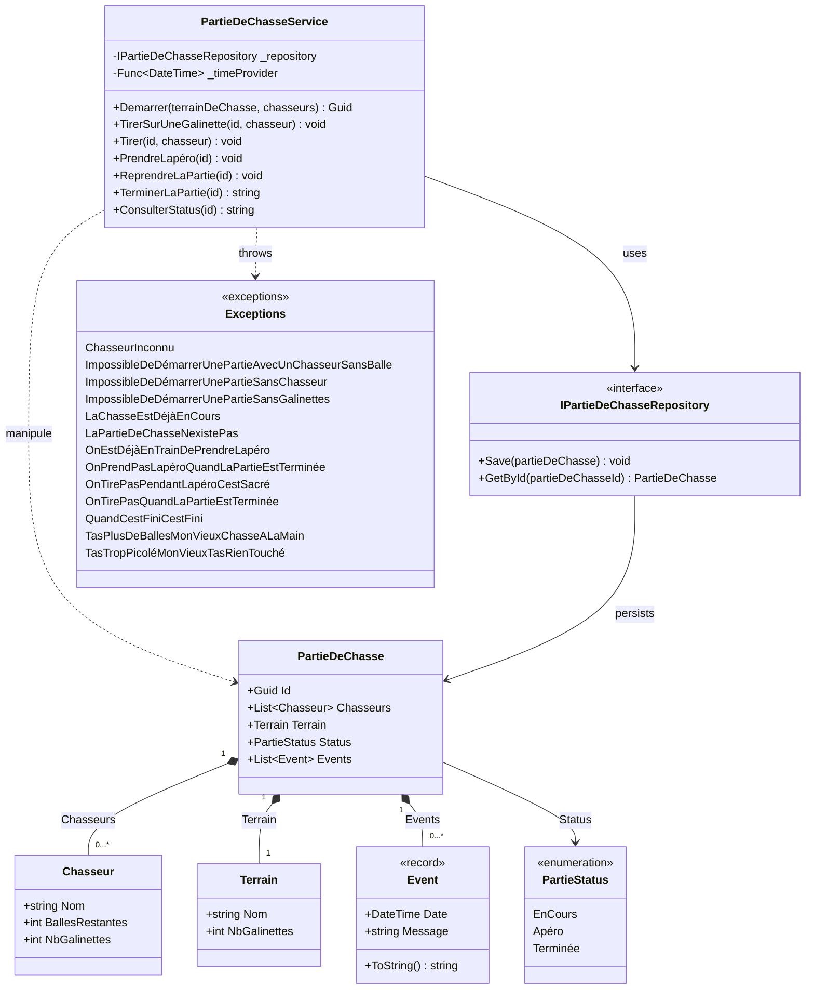

---
layout: section
---

<div class="flex items-center gap-16">

<div class="flex-1">

# Qui suis-je ?

<div class="accent-badge mb-6">Yoan Thirion</div>

- Responsable de la pédagogie - [école Coda Dijon](https://coda.school/)
- Software Crafter, Coach Agile, Juste un Dév
- GitHub : [@ythirion](https://github.com/ythirion)
- LinkedIn : [yoanthirion](https://www.linkedin.com/in/yoanthirion/)

</div>


</div>

---
layout: section
---

# Qui connait le Bouchonnois ?


---
layout: section
---

# Leur philosophie


---
codeSlide: true
---

<div class="flex items-center gap-12">

<div class="flex-1">


# Le contexte

> Nos valeureux chasseurs du Bouchonnois ont besoin de pouvoir gérer leurs parties de chasse.

Ils ont fait développer un système de gestion par l'entreprise `Toshiba`... et depuis, plus rien n'avance.

- Chaque nouvelle fonctionnalité prend plus de temps que la précédente
- L'entreprise parle d'une soi-disant `dette technique`, sans jamais l'expliquer

</div>


</div>

---
codeSlide: true
---

<div class="relative h-full flex items-center justify-center">


<a href="https://xtrem-tdd.netlify.app/Flavours/Practices/example-mapping" target="_blank" class="link-preview link-preview-sm absolute top-1 right-1">
  <div class="link-preview-title">Example Mapping</div>
  <div class="link-preview-url">xtrem-tdd.netlify.app/Flavours/Practices/example-mapping</div>
</a>

</div>

---
layout: section
---

<div class="flex items-center gap-12">

<div class="flex-1">

# Outside-in Code Review
- [ ] Technologies utilisées
- [ ] Compiler / exécuter le code : analyser les potentiels `Warning`
- [ ] Analyser la structure de la solution afin de comprendre l'architecture en place
- [ ] Regarder les dépendances afin de comprendre les interactions potentielles du système
- [ ] Calculer le `code coverage`
- [ ] Analyser le rapport d'analyse static de code
- [ ] Identifier s'il y a des [`hotspots`](https://understandlegacycode.com/blog/focus-refactoring-with-hotspots-analysis/) et où ils sont localisés

</div>
    <a href="https://canva.link/4b9mxwe0oxw67js" target="_blank">
        
    </a>
</div>

<!-- Libyear, Analyse comportementale de code, skill claude associée, C4 model, ... -->

---
layout: section
---

# Technologies utilisées

- `C#` / `.NET 10`
- `xUnit` + `NFluent`
- Coverage : `coverlet`
- Analyse statique de code : `SonarCloud`

---
layout: section
---

# Compiler


<div class="accent-badge mt-8">Aucun warning</div>

---
layout: section
---

# Architecture / Dépendances


---
codeSlide: true
---

<div class="h-full flex flex-col">

# Le code, en bref

<div class="mermaid-fit flex-1 min-h-0">



</div>

</div>

---
layout: section
---

# Calculer le code coverage

<div class="flex flex-col items-center gap-4">
  
  
</div>

---
layout: section
---

# Analyse static de code


---
layout: section
---


# Analyse static de code


---
layout: section
---

# Analyse comportementale de code


---
layout: section
---


<br/>
2 hostpots : PartieDeChasseService.cs, PartieDeChasseServiceTests.cs

---
codeSlide: true
---

# La complexité...

```csharp {all|27,34,39}{maxHeight:'380px'}
public void TirerSurUneGalinette(Guid id, string chasseur)
{
    var partieDeChasse = _repository.GetById(id);
    if (partieDeChasse == null)
    {
        throw new LaPartieDeChasseNexistePas();
    }
    if (partieDeChasse.Terrain.NbGalinettes != 0)
    {
        if (partieDeChasse.Status != PartieStatus.Apéro)
        {
            if (partieDeChasse.Status != PartieStatus.Terminée)
            {
                if (partieDeChasse.Chasseurs.Exists(c => c.Nom == chasseur))
                {
                    ...
                }
                else
                {
                    throw new ChasseurInconnu(chasseur);
                }
            }
            else
            {
                partieDeChasse.Events.Add(new Event(_timeProvider(), $"{chasseur} veut tirer -> On tire pas quand la partie est terminée"));
                _repository.Save(partieDeChasse);
                throw new OnTirePasQuandLaPartieEstTerminée();
            }
        }
        else
        {
            partieDeChasse.Events.Add(new Event(_timeProvider(), $"{chasseur} veut tirer -> On tire pas pendant l'apéro, c'est sacré !!!"));
            _repository.Save(partieDeChasse);
            throw new OnTirePasPendantLapéroCestSacré();
        }
    }
    else
    {
        throw new TasTropPicoléMonVieuxTasRienTouché();
    }
    _repository.Save(partieDeChasse);
}
```

---
layout: section
---

# Avant d'aller plus loin
Et si on faisait l'anatomie d'un test ?
Qu'est ce que vous associez à cela ?

---
layout: section
---


---
codeSlide: true
---

# Anatomie d'un test

```csharp {all|1|6-7|9-12|14-15|17-19}
public class AddANewComment
{
    private const string Author = "Les Inconnus";
    private const string AComment = "C'est exactement ça !!!";
    
    [Fact]
    public void In_An_Article_Include_Author_And_Text()
    {
        // Arrange
        var article = new Article(
            "Chasse = Un Art ?",
            "C'est sur que la chasse c'est un art, pour d'autres ça peut être la peinture, la musique, tout ça mais pour nous c'est la chasse quoi c'est un art…");
        
        // Act
        var updatedArticle = article.AddComment(Author, AComment);

        // Assert
        updatedArticle.IsRight.Should().BeTrue();
        AssertComment(updatedArticle.RightUnsafe().Comments.Head, Author, AComment);
    }
    ...
}   
```

---
codeSlide: true
---

# Un test du Bouchonnois

```csharp {all|1|4|6-15|17-18|20-35|all}{maxHeight:'380px'}
public class TirerSurUneGalinette
{
    [Fact]
    public void AvecUnChasseurAyantDesBallesEtAssezDeGalinettesSurLeTerrain()
    {
        // Arrange
        var id = Guid.NewGuid();
        var repository = new PartieDeChasseRepositoryForTests();
        repository.Add(new PartieDeChasse(id, new Terrain("Pitibon sur Sauldre") {NbGalinettes = 3},
        [
            new("Dédé") { BallesRestantes = 20 },
            new("Bernard") { BallesRestantes = 8 },
            new("Robert") { BallesRestantes = 12 }
        ]));
        var service = new PartieDeChasseService(repository, () => DateTime.Now);
    
        // Act
        service.TirerSurUneGalinette(id, "Bernard");
    
        // Assert
        var savedPartieDeChasse = repository.SavedPartieDeChasse();
        Check.That(savedPartieDeChasse!.Id).IsEqualTo(id);
        Check.That(savedPartieDeChasse.Status).IsEqualTo(PartieStatus.EnCours);
        Check.That(savedPartieDeChasse.Terrain.Nom).IsEqualTo("Pitibon sur Sauldre");
        Check.That(savedPartieDeChasse.Terrain.NbGalinettes).IsEqualTo(2);
        Check.That(savedPartieDeChasse.Chasseurs).HasSize(3);
        Check.That(savedPartieDeChasse.Chasseurs[0].Nom).IsEqualTo("Dédé");
        Check.That(savedPartieDeChasse.Chasseurs[0].BallesRestantes).IsEqualTo(20);
        Check.That(savedPartieDeChasse.Chasseurs[0].NbGalinettes).IsEqualTo(0);
        Check.That(savedPartieDeChasse.Chasseurs[1].Nom).IsEqualTo("Bernard");
        Check.That(savedPartieDeChasse.Chasseurs[1].BallesRestantes).IsEqualTo(7);
        Check.That(savedPartieDeChasse.Chasseurs[1].NbGalinettes).IsEqualTo(1);
        Check.That(savedPartieDeChasse.Chasseurs[2].Nom).IsEqualTo("Robert");
        Check.That(savedPartieDeChasse.Chasseurs[2].BallesRestantes).IsEqualTo(12);
        Check.That(savedPartieDeChasse.Chasseurs[2].NbGalinettes).IsEqualTo(0);
    }
}
```

<v-click>
Qu'est ce que vous identifiez comme axe d'amélioration ici ?
</v-click>

---
layout: section
---


<v-click>
Le bon test ne ment pas
</v-click>

---
layout: section
---

# Au programme

<div class="text-lg space-y-3 mt-4">

1. **Le bon test ne ment pas** — Mutation Testing
2. **Le bon test, on le lit** — Test Data Builders, DSL Given/When/Then
3. **Le bon test, on le maintient** — Clean Code appliqué aux tests
4. **Le bon test, parfois, ne s'écrit pas à la main** — Approval Testing
5. **Le bon test couvre ce que tu n'as pas pensé à tester** — Property-Based Testing
6. **Le bon test protège l'architecture** — Tests d'architecture

</div>

---
layout: statement
---

# Merci !

Des questions ?

<div class="accent-badge mt-6">#sharingiscaring</div>

---
layout: statement
---

# "Never trust a test you haven't seen fail."

Vladimir Khorikov
