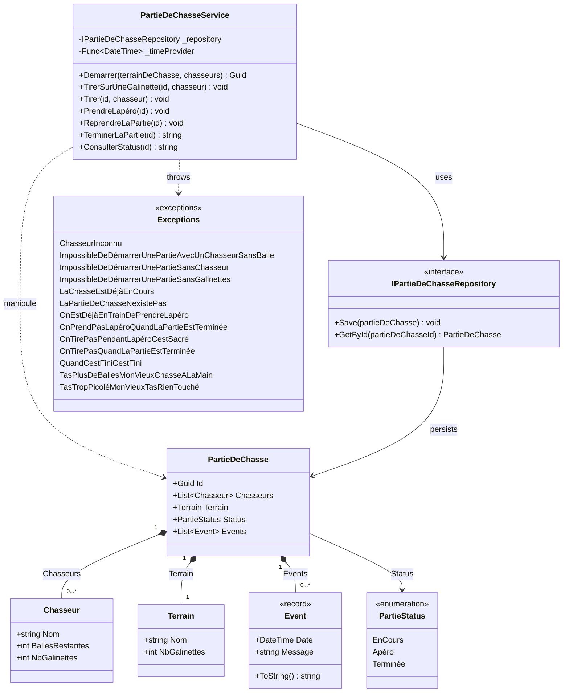

---
layout: section
---

<div class="flex items-center gap-16">

<div class="flex-1">

# Qui suis-je ?

<div class="accent-badge mb-6">Yoan Thirion</div>

- Responsable de la pédagogie - [école Coda Dijon](https://coda.school/)
- Software Crafter, Coach Agile, Juste un Dév
- GitHub : [@ythirion](https://github.com/ythirion)
- LinkedIn : [yoanthirion](https://www.linkedin.com/in/yoanthirion/)

</div>


</div>

---
layout: section
---

# Qui connait le Bouchonnois ?


---
layout: image
image: /quote-chasseurs.webp
---

---
codeSlide: true
---

<div class="flex items-center gap-12">

<div class="flex-1">


# Le contexte

> Nos valeureux chasseurs du Bouchonnois ont besoin de pouvoir gérer leurs parties de chasse.

Ils ont fait développer un système de gestion par l'entreprise `Toshiba`... et depuis, plus rien n'avance.

- Chaque nouvelle fonctionnalité prend plus de temps que la précédente
- L'entreprise parle d'une soi-disant `dette technique`, sans jamais l'expliquer

</div>


</div>

---
codeSlide: true
---

<div class="relative h-full flex items-center justify-center">


<a href="https://xtrem-tdd.netlify.app/Flavours/Practices/example-mapping" target="_blank" class="link-preview link-preview-sm absolute top-1 right-1">
  <div class="link-preview-title">Example Mapping</div>
  <div class="link-preview-url">xtrem-tdd.netlify.app/Flavours/Practices/example-mapping</div>
</a>

</div>

---
layout: section
---

<div class="flex items-center gap-12">

<div class="flex-1">

# Outside-in Code Review
- [ ] Technologies utilisées
- [ ] Compiler / exécuter le code : analyser les potentiels `Warning`
- [ ] Analyser la structure de la solution afin de comprendre l'architecture en place
- [ ] Regarder les dépendances afin de comprendre les interactions potentielles du système
- [ ] Calculer le `code coverage`
- [ ] Analyser le rapport d'analyse static de code
- [ ] Identifier s'il y a des [`hotspots`](https://understandlegacycode.com/blog/focus-refactoring-with-hotspots-analysis/) et où ils sont localisés

</div>
    <a href="https://canva.link/4b9mxwe0oxw67js" target="_blank">
        
    </a>
</div>

<!-- Libyear, Analyse comportementale de code, skill claude associée, C4 model, ... -->

---
layout: section
---

# Technologies utilisées

- `C#` / `.NET 10`
- `xUnit` + `NFluent`
- Coverage : `coverlet`
- Analyse statique de code : `SonarCloud`

---
layout: section
---

# Compiler


<div class="accent-badge mt-8">Aucun warning</div>

---
layout: section
---

# Architecture / Dépendances


---
codeSlide: true
---

<div class="h-full flex flex-col">

# Le code, en bref

<div class="mermaid-fit flex-1 min-h-0">



</div>

</div>

---
layout: section
---

# Calculer le code coverage

<div class="flex flex-col items-center gap-4">
  
  
</div>

---
layout: section
---

# Analyse static de code


---
layout: section
---


# Analyse static de code


---
layout: section
---

# Analyse comportementale de code


---
layout: section
---


<br/>

2 hostpots : `PartieDeChasseService.cs`, `PartieDeChasseServiceTests.cs`

---
codeSlide: true
---

# La complexité...

```csharp {all|27,34,39}{maxHeight:'380px'}
public void TirerSurUneGalinette(Guid id, string chasseur)
{
    var partieDeChasse = _repository.GetById(id);
    if (partieDeChasse == null)
    {
        throw new LaPartieDeChasseNexistePas();
    }
    if (partieDeChasse.Terrain.NbGalinettes != 0)
    {
        if (partieDeChasse.Status != PartieStatus.Apéro)
        {
            if (partieDeChasse.Status != PartieStatus.Terminée)
            {
                if (partieDeChasse.Chasseurs.Exists(c => c.Nom == chasseur))
                {
                    ...
                }
                else
                {
                    throw new ChasseurInconnu(chasseur);
                }
            }
            else
            {
                partieDeChasse.Events.Add(new Event(_timeProvider(), $"{chasseur} veut tirer -> On tire pas quand la partie est terminée"));
                _repository.Save(partieDeChasse);
                throw new OnTirePasQuandLaPartieEstTerminée();
            }
        }
        else
        {
            partieDeChasse.Events.Add(new Event(_timeProvider(), $"{chasseur} veut tirer -> On tire pas pendant l'apéro, c'est sacré !!!"));
            _repository.Save(partieDeChasse);
            throw new OnTirePasPendantLapéroCestSacré();
        }
    }
    else
    {
        throw new TasTropPicoléMonVieuxTasRienTouché();
    }
    _repository.Save(partieDeChasse);
}
```

---
layout: section
---

# Avant d'aller plus loin
Et si on faisait l'anatomie d'un test ?
Qu'est ce que vous associez à cela ?

---
layout: section
---


---
codeSlide: true
---

# Anatomie d'un test

```csharp {all|1|6-7|9-12|14-15|17-19}
public class AddANewComment
{
    private const string Author = "Les Inconnus";
    private const string AComment = "C'est exactement ça !!!";
    
    [Fact]
    public void In_An_Article_Include_Author_And_Text()
    {
        // Arrange
        var article = new Article(
            "Chasse = Un Art ?",
            "C'est sur que la chasse c'est un art, pour d'autres ça peut être la peinture, la musique, tout ça mais pour nous c'est la chasse quoi c'est un art…");
        
        // Act
        var updatedArticle = article.AddComment(Author, AComment);

        // Assert
        updatedArticle.IsRight.Should().BeTrue();
        AssertComment(updatedArticle.RightUnsafe().Comments.Head, Author, AComment);
    }
    ...
}   
```

---
layout: image
image: /tests-desiderata.webp
link: https://testdesiderata.com/
---

<!-- 
Isolated — tests should return the same results regardless of the order in which they are run.
Composable — I should be able to test different dimensions of variability separately and combine the results.
Deterministic — if nothing changes, the test result shouldn’t change.
Fast — tests should run quickly.
Writable — tests should be cheap to write relative to the cost of the code being tested.
Readable — tests should be comprehensible for reader, invoking the motivation for writing this particular test.
Behavioral — tests should be sensitive to changes in the behavior of the code under test. If the behavior changes, the test result should change.
Structure-insensitive — tests should not change their result if the structure of the code changes.
Automated — tests should run without human intervention.
Specific — if a test fails, the cause of the failure should be obvious.
Predictive — if the tests all pass, then the code under test should be suitable for production.
Inspiring — passing the tests should inspire confidence
-->

---
layout: image
image: /good-ut.webp
---

---
layout: section
---
# Quelques histoires
Maintenant qu'on a une meilleure vue sur le code, appliquons les préceptes des meilleurs devs du Bouchonnois :

<div class="text-lg space-y-3 mt-4">

1. **Le bon test ne ment pas**
2. **Le bon test, on le lit**
3. **Le bon test, on le maintient**
4. **Le bon test, parfois, ne s'écrit pas à la main**
5. **Le bon test couvre ce que tu n'as pas pensé à tester**
6. **Le bon test protège l'architecture**

</div>

---
layout: image
image: /01.le-bon-test-ne-ment-pas/tests-dont-lie.webp
---

---
codeSlide: true
---

# Un test du Bouchonnois

```csharp {all|1|4|6-15|17-18|20-35}{maxHeight:'380px'}
public class TirerSurUneGalinette
{
    [Fact]
    public void AvecUnChasseurAyantDesBallesEtAssezDeGalinettesSurLeTerrain()
    {
        // Arrange
        var id = Guid.NewGuid();
        var repository = new PartieDeChasseRepositoryForTests();
        repository.Add(new PartieDeChasse(id, new Terrain("Pitibon sur Sauldre") {NbGalinettes = 3},
        [
            new("Dédé") { BallesRestantes = 20 },
            new("Bernard") { BallesRestantes = 8 },
            new("Robert") { BallesRestantes = 12 }
        ]));
        var service = new PartieDeChasseService(repository, () => DateTime.Now);
    
        // Act
        service.TirerSurUneGalinette(id, "Bernard");
    
        // Assert
        var savedPartieDeChasse = repository.SavedPartieDeChasse();
        Check.That(savedPartieDeChasse!.Id).IsEqualTo(id);
        Check.That(savedPartieDeChasse.Status).IsEqualTo(PartieStatus.EnCours);
        Check.That(savedPartieDeChasse.Terrain.Nom).IsEqualTo("Pitibon sur Sauldre");
        Check.That(savedPartieDeChasse.Terrain.NbGalinettes).IsEqualTo(2);
        Check.That(savedPartieDeChasse.Chasseurs).HasSize(3);
        Check.That(savedPartieDeChasse.Chasseurs[0].Nom).IsEqualTo("Dédé");
        Check.That(savedPartieDeChasse.Chasseurs[0].BallesRestantes).IsEqualTo(20);
        Check.That(savedPartieDeChasse.Chasseurs[0].NbGalinettes).IsEqualTo(0);
        Check.That(savedPartieDeChasse.Chasseurs[1].Nom).IsEqualTo("Bernard");
        Check.That(savedPartieDeChasse.Chasseurs[1].BallesRestantes).IsEqualTo(7);
        Check.That(savedPartieDeChasse.Chasseurs[1].NbGalinettes).IsEqualTo(1);
        Check.That(savedPartieDeChasse.Chasseurs[2].Nom).IsEqualTo("Robert");
        Check.That(savedPartieDeChasse.Chasseurs[2].BallesRestantes).IsEqualTo(12);
        Check.That(savedPartieDeChasse.Chasseurs[2].NbGalinettes).IsEqualTo(0);
    }
}
```

---
codeSlide: true
---

# Et le code de production qu'il exerce ?

```csharp
public void TirerSurUneGalinette(Guid id, string chasseur)
{
    ...
    chasseurQuiTire.BallesRestantes--;
    chasseurQuiTire.NbGalinettes++;
    partieDeChasse.Terrain.NbGalinettes--;
    partieDeChasse.Events.Add(new Event(_timeProvider(), $"{chasseur} tire sur une galinette"));
}
```

<div class="mt-8 text-lg">

4 lignes de comportement métier. **Combien sont réellement vérifiées** par le test précédent ?

</div>

---
layout: section
---

# Ce test ment

<div class="text-lg space-y-4 max-w-3xl">

Le test vérifie l'`Id`, le `Status`, le `Terrain`, et l'état des 3 `Chasseurs`... mais jamais `Events`.

`Events` reconstitue **tout l'historique** d'une partie de chasse. Si un événement disparaît, se duplique ou change de contenu, ce test ne le verra **jamais**.

<div class="accent-badge mt-4">Plus un test a l'air minutieux, plus il inspire confiance à tort</div>

</div>

---
layout: section
---

<div class="flex flex-col items-center gap-6 text-center">

# Quoi ?! Mais on a 100% de code coverage !

<div class="accent-badge">100% coverage sur tous les fichiers</div>

</div>

---
layout: section
---


---
codeSlide: true
---

# Code Coverage

> La couverture de code mesure quelle portion du code source est **exécutée** par la suite de tests.

```
Code Coverage (%) = ( Lignes exécutées par les tests / Lignes exécutables totales ) × 100
```

<div class="mt-6 space-y-2 text-lg">

- Une couverture **faible** (ex : 10%) prouve qu'on ne teste pas assez ✅
- Une couverture **élevée** (même 100%) ne prouve **pas** qu'on a de bons tests ❌

</div>

---
codeSlide: true
---

# Branch Coverage

La couverture de branches se concentre sur les structures de contrôle (`if`, `switch`) : combien de chemins sont traversés par au moins un test.

```
Branch Coverage (%) = ( Branches exécutées par au moins un test / Nombre total de branches ) × 100
```

```java
// 2 chemins possibles : length > 5 et length <= 5
// Un test sur un seul chemin = 50% de branch coverage
public static boolean isLong(String s) {
    return s.length() > 5;
}
```

<div class="mt-4 text-lg">1 test (`isLong("hello") == false`) → 100% de <strong>Code Coverage</strong>, seulement 50% de <strong>Branch Coverage</strong>.</div>

---
layout: statement
---

# Code Coverage : bon indicateur négatif, mauvais indicateur positif

<div class="accent-badge mt-6">Le coverage ne dit jamais si ce que tu as testé est bien testé</div>

---
codeSlide: true
---

<div class="flex items-center gap-12">

<div class="flex-1">

# Le Mutation Testing à la rescousse ?

Introduire volontairement un petit bug (un `mutant`) dans le code de production, puis relancer les tests.

```
Mutation Score (%) = ( Mutants tués / Mutants générés ) × 100
```

<div class="mt-6 space-y-2 text-lg">

- Un test échoue → le mutant est **tué** → le comportement est réellement vérifié
- Tous les tests passent → le mutant **survit** → aucun test ne vérifie ce comportement

</div>

</div>


</div>

---
codeSlide: true
---

# Démo : mutation

<div class="text-lg space-y-3 max-w-2xl">

- On choisit une ligne du code de production
- On la modifie/supprime à la main - c'est notre `mutant`
- On relance la suite de tests

<div class="accent-badge mt-4">Les tests passent toujours : le mutant a survécu...</div>

</div>

---
layout: section
---

<div class="flex items-center gap-12">

<div class="flex-1">

# Stryker : trouve des mutants pour nous

```bash
dotnet tool install -g dotnet-stryker
```

```bash
cd src
dotnet stryker
```

</div>

<div class="flex flex-col items-center gap-4 flex-shrink-0 w-72">


<a href="https://stryker-mutator.io/docs/stryker-net/introduction/" target="_blank" class="link-preview w-full">
  <div class="link-preview-title">Stryker.NET</div>
  <div class="link-preview-url">stryker-mutator.io/docs/stryker-net</div>
</a>

</div>

</div>

---
layout: section
---

# Exemples de Mutators

<div class="flex flex-row items-center justify-center gap-4">
  
  
  
</div>

<a href="https://stryker-mutator.io/docs/stryker-net/mutations/" target="_blank" class="link-preview link-preview-sm mt-6 mx-auto w-fit">
  <div class="link-preview-title">Mutators</div>
  <div class="link-preview-url">stryker-mutator.io/docs/stryker-net/mutations</div>
</a>

---
layout: section
---

# Rapport de mutation


---
layout: section
---

# String mutation

<div class="flex flex-row items-center justify-center gap-4">
  
  
</div>

---
layout: section
---

# Removal / Statement mutation

<div class="flex flex-col items-center gap-4">
  
</div>

---
layout: section
---

# LinQ mutation


---
codeSlide: true
---

# Démo : tueur de mutant


---
layout: image
image: /01.le-bon-test-ne-ment-pas/a-few-minutes-later.webp
---

---
layout: section
---

# Plus de mutants !


---
codeSlide: true
---

# Ce qu'il faut retenir

<div class="grid grid-cols-2 gap-8 mt-4">

<div>

### Code Coverage
Métrique **quantitative**

Combien de lignes/branches sont *exécutées* par les tests

</div>

<div>

### Mutation Testing
Métrique **qualitative**

En quoi ce qui est exécuté est réellement *vérifié* par les tests

</div>

</div>

<div class="mt-8 text-lg space-y-2">

- Permet de jauger la **qualité** de nos tests
- Permet aussi d'identifier des **cas limites** auxquels on n'avait pas pensé

</div>

<div class="accent-badge mt-6">Lent à exécuter</div>

---
layout: image
image: /02.le-bon-test-on-le-lit/le-bon-test-on-le-lit.webp
---

---
layout: statement
---

# "Any fool can write code that a computer can understand. Good programmers write code that humans can understand."

Martin Fowler

---
codeSlide: true
---

# Un test qu'il faut déchiffrer

On a tué nos mutants (Histoire 1). `Events` est vérifié partout, `Stryker` est content. Regardons `AvecUnChasseurAyantDesBallesEtAssezDeGalinettesSurLeTerrain` une fois corrigé :

```csharp {all|17-25|27|29-37}{maxHeight:'340px'}
public class PartieDeChasseServiceTests
{
    private static readonly DateTime Now = new(2024, 6, 6, 14, 50, 45);
    private static readonly Func<DateTime> TimeProvider = () => Now;

    private static void AssertLastEvent(PartieDeChasse partieDeChasse, string expectedMessage)
    {
        Check.That(partieDeChasse.Events).HasSize(1);
        Check.That(partieDeChasse.Events[0]).IsEqualTo(new Event(Now, expectedMessage));
    }

    public class TirerSurUneGalinette
    {
        [Fact]
        public void AvecUnChasseurAyantDesBallesEtAssezDeGalinettesSurLeTerrain()
        {
            var id = Guid.NewGuid();
            var repository = new PartieDeChasseRepositoryForTests();
            repository.Add(new PartieDeChasse(id, new Terrain("Pitibon sur Sauldre") {NbGalinettes = 3},
            [
                new("Dédé") { BallesRestantes = 20 },
                new("Bernard") { BallesRestantes = 8 },
                new("Robert") { BallesRestantes = 12 }
            ]));
            var service = new PartieDeChasseService(repository, TimeProvider);

            service.TirerSurUneGalinette(id, "Bernard");

            var savedPartieDeChasse = repository.SavedPartieDeChasse();
            Check.That(savedPartieDeChasse!.Id).IsEqualTo(id);
            Check.That(savedPartieDeChasse.Status).IsEqualTo(PartieStatus.EnCours);
            Check.That(savedPartieDeChasse.Terrain.Nom).IsEqualTo("Pitibon sur Sauldre");
            Check.That(savedPartieDeChasse.Terrain.NbGalinettes).IsEqualTo(2);
            Check.That(savedPartieDeChasse.Chasseurs).HasSize(3);
            // ... 8 lignes de Check.That sur Dédé, Bernard, Robert

            AssertLastEvent(savedPartieDeChasse, "Bernard tire sur une galinette");
        }
    }
}
```

---
layout: section
---

<div class="text-lg space-y-4 max-w-3xl">

# Ce test ne ment plus. Mais...

Il n'a pas rétréci - il a même **grandi** d'une ligne. Chaque test d'erreur en a gagné deux (`.WithMessage(...)`, `AssertLastEvent(...)`).

Le signal (*"1 balle en moins, 1 galinette de plus pour Bernard"*) reste noyé dans le bruit (`Id`, `Nom`, `Terrain`... répétés à l'identique d'un test à l'autre).

<div class="accent-badge mt-4">Combien de temps pour dire ce que ce test prouve, sans l'exécuter ?</div>

</div>

---
layout: statement
---

# Une seule classe, `848+` lignes, des dizaines de tests qui se ressemblent tous

<div class="accent-badge mt-6">Un bon test se lit / comprend en 5 secondes</div>

---
codeSlide: true
---

<div class="h-full flex items-center justify-center">

<div class="flex flex-col items-center gap-4 max-w-2xl">

# Test Data Builders

Sans builder - couplé au constructeur :

```csharp
var address = new Address("Rue Sainte Catherine", "Bordeaux", new PostalCode("33000", "1 Bis"));
```

<div class="accent-badge">Si le constructeur d'Address change, chaque test qui construit une Address doit changer</div>

<v-click>

Avec un `Test Data Builder` :

```csharp
var address = ANewAddress()
    .At("Bordeaux")
    .InStreet("Rue Sainte Catherine")
    .WithPostalCode(_ => _.WithNumber("1 Bis"))
    .Build();
```

<a href="https://blog.ploeh.dk/2017/08/15/test-data-builders-in-c/" target="_blank" class="link-preview link-preview-sm mt-2">
  <div class="link-preview-title">Test Data Builders in C#</div>
  <div class="link-preview-url">blog.ploeh.dk/2017/08/15/test-data-builders-in-c</div>
</a>
</v-click>

</div>

</div>

---
codeSlide: true
---

# Le Builder : un point d'interception

<div class="flex items-center gap-12">

<div class="flex-1 min-w-0">


```csharp {all|28-29}{maxHeight:'320px'}
public class AddressBuilder
{
    private string _city = "Paris";
    private string _street = "";
    private PostalCodeBuilder _postalCode = new();

    public static AddressBuilder ANewAddress() => new();

    public AddressBuilder At(string city)
    {
        _city = city;
        return this;
    }

    public AddressBuilder InStreet(string street)
    {
        _street = street;
        return this;
    }

    public AddressBuilder WithPostalCode(
        Func<PostalCodeBuilder, PostalCodeBuilder> configure)
    {
        _postalCode = configure(_postalCode);
        return this;
    }

    // Seul endroit qui connaît la signature du constructeur d'Address
    public Address Build() => new(_street, _city, _postalCode.Build());
}
```

</div>

<div class="flex-shrink-0 w-72 text-lg">

Si `Address` gagne un champ, perd un champ, ou change l'ordre de ses paramètres : **un seul fichier à modifier**.

<div class="accent-badge mt-4">Pas de résistance aux refactorings</div>

</div>

</div>

---
layout: statement
---

# "This eliminates the irrelevant, and amplifies the essentials of the test."

Robert C. Martin

---
codeSlide: true
---

<div class="h-full flex items-center justify-center">

<div class="flex flex-col items-center gap-4 max-w-2xl">

# Object Mothers

Des méthodes statiques nommées qui construisent un objet "connu" et réutilisable, pour ne pas ressaisir ses détails dans chaque test :

```java
Address anAdressAtDijon = Addresses.Dijon();
```

<div class="accent-badge">Mais la moindre variation fait exploser le nombre de méthodes</div>

```java 
Address anAdressAtParis = Addresses.Paris();
Address anAdressAtLondon = Addresses.London();
Address anAdressAtRennes = Addresses.Rennes();
// ...
```

<div class="text-sm opacity-80">D'où l'intérêt de combiner Object Mother (points de départ nommés) et Builder (variations) - ce qu'on va faire dans le Bouchonnois.</div>

<a href="http://www.natpryce.com/articles/000714.html" target="_blank" class="link-preview link-preview-sm mt-2">
  <div class="link-preview-title">Test Data Builders vs Object Mother</div>
  <div class="link-preview-url">natpryce.com/articles/000714.html</div>
</a>

</div>

</div>

---
layout: section
---

# Des assertions qui parlent métier

<div class="text-lg space-y-3 max-w-2xl">

`AssertLastEvent` (Histoire 1) est déjà une bonne intuition : une méthode nommée qui cache 2 `Check.That` derrière une phrase métier.

On va généraliser cette intuition à tout le reste du bloc d'assertions - puis pousser le raisonnement un cran plus loin.

</div>

---
layout: section
---

# Splitter la classe de tests

<div class="flex flex-row items-center justify-center gap-6">
  
  
</div>

<div class="text-center mt-4">

On centralise `Repository` / `Service` (extract field, puis pull up member)

</div>

---
layout: section
---

<div class="flex flex-col items-center gap-4">
  
  
</div>

<div class="text-center mt-2">

Chaque classe part `safe` dans son propre fichier

</div>

---
layout: section
---

# Unit vs Acceptance


<div class="text-center mt-4">

`ScenarioTests.cs` rejoue une partie entière : ce n'est pas un test unitaire, il mérite son propre dossier

</div>

---
codeSlide: true
---

# Démo : écrire son premier Test Data Builder

<div class="flex flex-row items-center gap-8">

<v-click>
    
</v-click>

<div class="flex-1">

On écrit d'abord, en mots, ce qu'on voudrait pouvoir écrire, puis on génère le code depuis l'IDE.

<a href="https://xtrem-tdd.netlify.app/Flavours/generate-code-from-usage" target="_blank" class="link-preview link-preview-sm mt-4">
  <div class="link-preview-title">Generate Code From Usage</div>
  <div class="link-preview-url">xtrem-tdd.netlify.app/Flavours/generate-code-from-usage</div>
</a>

</div>

</div>

---
codeSlide: true
---

# PartieDeChasseBuilder

```csharp {all|7|3-5|9-13|21-26}{maxHeight:'380px'}
public class PartieDeChasseBuilder
{
    private int _nbGalinettes = 3;
    private PartieStatus _status = PartieStatus.EnCours;
    private ChasseurBuilder[] _chasseurs = [];

    public static PartieDeChasseBuilder UnePartieDeChasseDuBouchonnois() => new();

    public PartieDeChasseBuilder SurUnTerrainRicheEnGalinettes(int nbGalinettes = 3)
    {
        _nbGalinettes = nbGalinettes;
        return this;
    }

    public PartieDeChasseBuilder Avec(params ChasseurBuilder[] chasseurs)
    {
        _chasseurs = chasseurs;
        return this;
    }

    public PartieDeChasse Build() => new(
        Guid.NewGuid(),
        new Terrain("Pitibon sur Sauldre") { NbGalinettes = _nbGalinettes },
        _chasseurs.Select(c => c.Build()).ToList(),
        _status
    );
}
```

---
codeSlide: true
---

# ChasseurBuilder : Builder + Object Mother

```csharp {all|13-16}{maxHeight:'380px'}
public class ChasseurBuilder
{
    private readonly string _nom;
    private int _ballesRestantes;
    private int _nbGalinettes;

    private ChasseurBuilder(string nom, int ballesRestantes)
    {
        _nom = nom;
        _ballesRestantes = ballesRestantes;
    }

    // Object Mothers
    public static ChasseurBuilder Dédé() => new("Dédé", ballesRestantes: 20);
    public static ChasseurBuilder Bernard() => new("Bernard", ballesRestantes: 8);
    public static ChasseurBuilder Robert() => new("Robert", ballesRestantes: 12);

    public Chasseur Build() => new(_nom)
    {
        BallesRestantes = _ballesRestantes,
        NbGalinettes = _nbGalinettes
    };
}
```

---
layout: section
---

# On identifie ce qu'on veut pouvoir écrire


---
codeSlide: true
---

# Premier réflexe : `Should` / `Have`

```csharp
savedPartieDeChasse.ShouldHaveChasseurWith("Bernard", ballesRestantes: 7, galinettes: 1);
savedPartieDeChasse.ShouldHaveGalinettesOnTerrain(2);
savedPartieDeChasse.ShouldHaveEmittedEvent(Now, "Bernard tire sur une galinette");
```

<div class="mt-8 text-lg max-w-2xl">

Déjà bien plus lisible qu'un bloc de `Check.That`. Mais `Should` / `Have` restent du vocabulaire de **testeur**, pas du vocabulaire **métier** - jamais dans la bouche d'un chasseur du Bouchonnois.

</div>

---
codeSlide: true
---

# On nomme dans le langage du métier

```csharp {all|3-9|11-18|20-24}{maxHeight:'340px'}
public static class PartieDeChasseAssertions
{
    public static PartieDeChasse AÉmisLÉvénement(
        this PartieDeChasse partieDeChasse, DateTime expectedTime, string expectedMessage)
    {
        Check.That(partieDeChasse.Events).HasSize(1);
        Check.That(partieDeChasse.Events[0]).IsEqualTo(new Event(expectedTime, expectedMessage));
        return partieDeChasse;
    }

    public static PartieDeChasse ContientLeChasseurAvec(
        this PartieDeChasse partieDeChasse, string nom, int ballesRestantes, int galinettes)
    {
        var chasseur = partieDeChasse.Chasseurs.Single(c => c.Nom == nom);
        Check.That(chasseur.BallesRestantes).IsEqualTo(ballesRestantes);
        Check.That(chasseur.NbGalinettes).IsEqualTo(galinettes);
        return partieDeChasse;
    }

    public static PartieDeChasse ContientLesGalinettes(this PartieDeChasse partieDeChasse, int nbGalinettes)
    {
        Check.That(partieDeChasse.Terrain.NbGalinettes).IsEqualTo(nbGalinettes);
        return partieDeChasse;
    }
}
```

---
layout: section
---

<div class="text-lg space-y-4 max-w-3xl">

# Pourquoi ça compte vraiment ?

Chaînées, ces assertions se lisent comme une phrase qui décrit l'état attendu de la partie de chasse - pas comme une checklist technique.

C'est le nom de la méthode qui apparaît dans le message d'échec quand le test devient rouge :

```
at PartieDeChasseAssertions.ContientLeChasseurAvec(...)
```

<div class="accent-badge mt-4">Moins de traduction mentale entre l'échec et sa compréhension = moins de charge cognitive</div>

</div>

---
codeSlide: true
---

# Le test se réduit à ce qui compte

```csharp
[Fact]
public void AvecUnChasseurAyantDesBallesEtAssezDeGalinettesSurLeTerrain()
{
    var partieDeChasse = AvecUnePartieDeChasseExistante(
        UnePartieDeChasseDuBouchonnois()
            .SurUnTerrainRicheEnGalinettes()
            .Avec(Dédé(), Bernard(), Robert())
    );

    PartieDeChasseService.TirerSurUneGalinette(partieDeChasse.Id, "Bernard");

    Repository.SavedPartieDeChasse()!
        .ContientLeChasseurAvec("Bernard", ballesRestantes: 7, galinettes: 1)
        .ContientLesGalinettes(2)
        .AÉmisLÉvénement(Now, "Bernard tire sur une galinette");
}
```

<div class="accent-badge mt-6">De 33 à 8 lignes</div>

---
layout: section
---

# On vérifie la fiabilité de ces nouveaux outils


<div class="text-center mt-4">Mutant introduit à la main (chasseurQuiTire.NbGalinettes++) : détecté ✅</div>

---
layout: statement
---

# Le bon test, on le lit en 5 secondes

<div class="accent-badge mt-6">Test Data Builders + Object Mothers + assertions métier</div>

---
codeSlide: true
---

# Ce qu'il faut retenir

<div class="mt-4 text-lg space-y-2">

- **Test Data Builders + Object Mothers** : cachent le bruit de l'`Arrange`, ne laissent apparaître que ce qui compte pour le test
- **Assertions métier** (`ContientLeChasseurAvec`, `AÉmisLÉvénement`, ...) : le nom de la méthode devient le message d'erreur quand le test échoue

</div>

<div class="accent-badge mt-6">

Élimine ce qui n'est pas pertinent, et amplifie l'essentiel du test.

</div>

---
layout: image
image: /03.le-bon-test-ne-secrit-pas-a-la-main/le-bon-test-ne-secrit-pas-a-la-main.webp
---

---
codeSlide: true
---

# Un test compliqué...

```csharp {all|14-17|19-20|22-23|25-26|28-29|69-75|83-105}{maxHeight:'340px'}
[Fact]
public void DéroulerUnePartie()
{
    var time = new DateTime(2024, 4, 25, 9, 0, 0);
    var repository = new PartieDeChasseRepositoryForTests();
    var service = new PartieDeChasseService(repository, () => time);
    var chasseurs = new List<(string, int)>
    {
        ("Dédé", 20),
        ("Bernard", 8),
        ("Robert", 12)
    };
    var terrainDeChasse = ("Pitibon sur Sauldre", 4);
    var id = service.Demarrer(
        terrainDeChasse,
        chasseurs
    );

    time = time.Add(TimeSpan.FromMinutes(10));
    service.Tirer(id, "Dédé");

    time = time.Add(TimeSpan.FromMinutes(30));
    service.TirerSurUneGalinette(id, "Robert");

    time = time.Add(TimeSpan.FromMinutes(20));
    service.PrendreLapéro(id);

    time = time.Add(TimeSpan.FromHours(1));
    service.ReprendreLaPartie(id);

    time = time.Add(TimeSpan.FromMinutes(2));
    service.Tirer(id, "Bernard");

    time = time.Add(TimeSpan.FromMinutes(1));
    service.Tirer(id, "Bernard");

    time = time.Add(TimeSpan.FromMinutes(1));
    service.TirerSurUneGalinette(id, "Dédé");

    time = time.Add(TimeSpan.FromMinutes(26));
    service.TirerSurUneGalinette(id, "Robert");

    time = time.Add(TimeSpan.FromMinutes(10));
    service.PrendreLapéro(id);

    time = time.Add(TimeSpan.FromMinutes(170));
    service.ReprendreLaPartie(id);

    time = time.Add(TimeSpan.FromMinutes(11));
    service.Tirer(id, "Bernard");

    time = time.Add(TimeSpan.FromSeconds(1));
    service.Tirer(id, "Bernard");

    time = time.Add(TimeSpan.FromSeconds(1));
    service.Tirer(id, "Bernard");

    time = time.Add(TimeSpan.FromSeconds(1));
    service.Tirer(id, "Bernard");

    time = time.Add(TimeSpan.FromSeconds(1));
    service.Tirer(id, "Bernard");

    time = time.Add(TimeSpan.FromSeconds(1));
    service.Tirer(id, "Bernard");

    time = time.Add(TimeSpan.FromSeconds(1));

    try
    {
        service.Tirer(id, "Bernard");
    }
    catch (TasPlusDeBallesMonVieuxChasseALaMain)
    {
    }

    time = time.Add(TimeSpan.FromMinutes(19));
    service.TirerSurUneGalinette(id, "Robert");

    time = time.Add(TimeSpan.FromMinutes(30));
    service.TerminerLaPartie(id);

    Check.That(service.ConsulterStatus(id))
        .IsEqualTo(
            @"15:30 - La partie de chasse est terminée, vainqueur : Robert - 3 galinettes
15:00 - Robert tire sur une galinette
14:41 - Bernard tire -> T'as plus de balles mon vieux, chasse à la main
14:41 - Bernard tire
14:41 - Bernard tire
14:41 - Bernard tire
14:41 - Bernard tire
14:41 - Bernard tire
14:41 - Bernard tire
14:30 - Reprise de la chasse
11:40 - Petit apéro
11:30 - Robert tire sur une galinette
11:04 - Dédé tire sur une galinette
11:03 - Bernard tire
11:02 - Bernard tire
11:00 - Reprise de la chasse
10:00 - Petit apéro
09:40 - Robert tire sur une galinette
09:10 - Dédé tire
09:00 - La partie de chasse commence à Pitibon sur Sauldre avec Dédé (20 balles), Bernard (8 balles), Robert (12 balles)"
        );
}
```

<div class="mt-6 text-lg">Une seule assertion, mais qui vérifie l'intégralité de l'historique produit par 19 actions.</div>

---
layout: section
---

<div class="text-lg space-y-4 max-w-3xl">

Cette chaîne n'a pas été écrite, elle a été **capturée** - exécutée une fois, puis recopiée telle quelle dans le test.

</div>

---
layout: section
---

<div class="flex items-center gap-12">

<div class="flex-1">

# Le concept : Approval Testing

Au lieu d'écrire la valeur attendue à la main, on **capture** la sortie réelle du code dans un fichier de référence, et on laisse un outil comparer, à chaque exécution, la sortie du jour à ce fichier.

</div>

<a href="https://github.com/ythirion/approval-testing-kata#2-approval-testing" target="_blank" class="link-preview flex-shrink-0 w-72">
  <div class="link-preview-title">Approval Testing</div>
  <div class="link-preview-url">github.com/ythirion/approval-testing-kata</div>
</a>

</div>

---
layout: section
---

# Le cycle capture / approuve / compare

<div class="text-lg space-y-3 mt-4">

- Pas de "fichier de référence" : le test échoue, on nous montre la sortie produite
- On la relit, on l'**approuve**
- Exécutions suivantes : identique 🟢, différent 🔴 (avec un diff sous les yeux)

</div>

---
layout: statement
---

# Un air de déjà-vu : le `Golden Master`

<div class="accent-badge mt-6">Michael Feathers - Working Effectively with Legacy Code</div>

---
layout: section
---

<div class="text-lg space-y-4 max-w-3xl">

Face à du code existant, sans spec fiable, dont personne ne sait exactement ce qu'il est censé faire : on ne *devine* pas le comportement attendu, on **capture** le comportement actuel, tel quel.

<div class="accent-badge mt-4">

Un système développé par `Toshiba`, une `dette technique` jamais expliquée...

</div>

Ça te rappelle quelque chose ?

</div>

---
layout: section
---

<div class="flex items-center gap-12">

<div class="flex-1">

# Verify

```bash
dotnet add package Verify.xUnit
```

```csharp
global using VerifyTests;
global using static VerifyXunit.Verifier;
```

</div>

<a href="https://github.com/VerifyTests/Verify" target="_blank" class="link-preview flex-shrink-0 w-72">
  <div class="link-preview-title">Verify</div>
  <div class="link-preview-url">github.com/VerifyTests/Verify</div>
</a>

</div>

---
codeSlide: true
---

# Démo

<v-click>

```csharp {all|18}{maxHeight:'380px'}
public class ScenarioTests
{
    [Fact]
    public Task DéroulerUnePartie()
    {
        var time = new DateTime(2024, 4, 25, 9, 0, 0);
        var repository = new PartieDeChasseRepositoryForTests();
        var service = new PartieDeChasseService(repository, () => time);
        var chasseurs = new List<(string, int)> { ("Dédé", 20), ("Bernard", 8), ("Robert", 12) };
        var id = service.Demarrer(("Pitibon sur Sauldre", 4), chasseurs);

        time = time.Add(TimeSpan.FromMinutes(10));
        service.Tirer(id, "Dédé");
        // ... les 17 autres actions du scénario, inchangées ...
        time = time.Add(TimeSpan.FromMinutes(30));
        service.TerminerLaPartie(id);

        return Verify(service.ConsulterStatus(id));
    }
}
```

<div class="mt-4 text-lg">La <code>string</code> de 19 lignes recopiée à la main disparaît. Le test passe du premier coup 👌</div>

</v-click>

---
layout: section
---

# Vérifier que le test peut échouer

On modifie le fichier `.verified.txt` à la main et on relance.

<div class="flex flex-col items-center gap-3 my-4">
  
</div>

<div class="accent-badge">Never trust a test you haven't seen fail - Approval Test ou pas</div>

---
layout: section
---

# `.gitignore`

```text
*.received.txt
```

<div class="mt-4 text-lg"><code>*.received.txt</code> = la sortie produite à chaque run raté, jamais à committer. Seul le <code>.verified.txt</code> l'est.</div>

---
layout: section
---

<div class="flex items-center gap-12">

<div class="flex-1">

# `Boy Scout Rule`

Le test est fiable - mais pas très lisible : duplication, `try / catch` vide, méthode de plus de 80 lignes.

</div>


</div>

---
layout: image
image: /01.le-bon-test-ne-ment-pas/a-few-minutes-later.webp
---

---
codeSlide: true
---

# Version refactorée

```csharp {all|3-6|16-19|23-26}{maxHeight:'400px'}
public class ScenarioTests
{
    // Extraction de champs : _time, _repository, _service
    private DateTime _time = new(2024, 4, 25, 9, 0, 0);
    private readonly PartieDeChasseRepositoryForTests _repository = new();
    private readonly PartieDeChasseService _service;

    public ScenarioTests()
    {
        _service = new PartieDeChasseService(_repository, () => _time);
    }

    [Fact]
    public Task DéroulerUnePartie()
    {
        // CommandBuilder + Chasseurs : suppression des string en dur
        var command = DémarrerUnePartieDeChasse()
            .Avec((Chasseurs.Dédé, 20), (Chasseurs.Bernard, 8), (Chasseurs.Robert, 12))
            .SurUnTerrainRicheEnGalinettes();

        var id = _service.Demarrer(command.Terrain, command.Chasseurs);

        // Extraction de méthode : avance le temps, exécute, ignore l'exception éventuelle
        After(TimeSpan.FromMinutes(10), () => _service.Tirer(id, Chasseurs.Dédé));
        // ... reste du scénario, une ligne par action ...
        After(TimeSpan.FromMinutes(30), () => _service.TerminerLaPartie(id));

        return Verify(_service.ConsulterStatus(id));
    }
    ...
}
```

---
codeSlide: true
---

# Ce qu'il faut retenir

<div class="mt-4 text-lg space-y-2">

- `Approval Testing` = capturer la sortie réelle, l'approuver, laisser un outil comparer - à chaque lancement
- Appliquer la `Boy Scout Rule` sur nos tests

</div>

<div class="accent-badge mt-6">Accorder la même importance à nos tests qu'à notre code de production</div>

---
layout: image
image: 04.le-bon-test-couvre-ce-que-tu-nas-pas-pense-a-tester/le-bon-test-couvre-ce-que-tu-nas-pas-imagine.webp
---

---
codeSlide: true
---

# Un exemple, c'est un point. La règle, c'est une droite.

```csharp
[Fact]
public Task AvecPlusieursChasseurs()
{
    var command = DémarrerUnePartieDeChasse()
        .Avec((Chasseurs.Dédé, 20), (Chasseurs.Bernard, 8), (Chasseurs.Robert, 12))
        .SurUnTerrainRicheEnGalinettes(3);

    PartieDeChasseService.Demarrer(command.Terrain, command.Chasseurs);

    return Verify(Repository.SavedPartieDeChasse())
        .DontScrubDateTimes();
}
```

<div class="mt-6 text-lg">3 chasseurs nommés, un terrain à 3 galinettes. Est-ce que ce sont ces valeurs précises qui comptent - ou une règle plus générale qu'elles illustrent ?</div>

---
layout: statement
---

# Un seul test avec des exemples fixes ne peut te dire que : "ça marche pour ces valeurs-là"

---
layout: section
---


<div class="text-center mt-4">Les tests <code>example-based</code> couvrent bien la conformité métier, mal l'espace des entrées possibles</div>

---
layout: section
---
# Le concept : Property-Based Testing

<div class="flex items-center gap-12">

<div class="flex-1">


On fixe une **règle** censée être vraie pour *toute* entrée valide, puis on laisse un framework **générer** des dizaines d'entrées aléatoires pour essayer de la mettre en défaut.

</div>

<a href="https://xtrem-tdd.netlify.app/Flavours/Testing/pbt/" target="_blank" class="link-preview flex-shrink-0">
  <div class="link-preview-title">Property-Based Testing</div>
  <div class="link-preview-url">xtrem-tdd.netlify.app/Flavours/Testing/pbt</div>
</a>

</div>

---
layout: section
---


---
layout: section
---


<div class="text-center mt-4">Un <code>Generator</code> produit les entrées, un <code>Shrinker</code> réduit l'entrée qui a fait échouer la propriété au plus petit cas possible</div>

---
layout: section
---

<div class="flex items-center gap-12">

<div class="flex-1">

# FsCheck

```bash
dotnet add package FsCheck.Xunit
```

```csharp
using FsCheck.Fluent;
using FsCheck.Xunit;
```

</div>

<a href="https://fscheck.github.io/FsCheck/Properties.html" target="_blank" class="link-preview flex-shrink-0">
  <div class="link-preview-title">FsCheck</div>
  <div class="link-preview-url">fscheck.github.io/FsCheck/Properties.html</div>
</a>

</div>

---
codeSlide: true
---

# Écrire une propriété : l'addition

<div class="text-lg mb-2">On annote avec <code>[Property]</code>, on retourne une <code>Property</code> - un prédicat passé à <code>.ToProperty()</code>. FsCheck génère lui-même les paramètres.</div>

```csharp {all|1-4|6-9|11-14}
// Commutativité : l'ordre des termes n'a pas d'importance -> 2 + 3 = 3 + 2
[Property]
public Property Commutativity(int x, int y) =>
    (Add(x, y) == Add(y, x)).ToProperty();

// Associativité : peu importe comment on regroupe les additions -> (x + 1) + 1 = x + 2
[Property]
public Property Associativity(int x) =>
    (Add(Add(x, 1), 1) == Add(x, 2)).ToProperty();

// Élément neutre : ajouter 0 laisse le nombre inchangé -> x + 0 = x
[Property]
public Property Identity(int x) =>
    (Add(x, 0) == x).ToProperty();
```

---
layout: section
---

# Quelles propriétés identifier ?


---
codeSlide: true
---

# Démarrer une partie : identifier la règle

```text
forall (terrain avec des galinettes, groupe de chasseurs tous armés)
La partie de chasse doit démarrer avec succès
```

<div class="mt-6 text-lg space-y-2">

- Peu importe le nom du terrain ou des chasseurs
- Peu importe leur nombre
- Seule compte la précondition : au moins 1 galinette, au moins 1 balle chacun

</div>

---
codeSlide: true
---

# Les générateurs

```csharp {all|1-2|4-7|9-12|14-17}{maxHeight:'380px'}
private static FsCheck.Gen<string> NomGenerator()
    => ArbMap.Default.GeneratorFor<string>().Where(nom => !string.IsNullOrWhiteSpace(nom));

private static FsCheck.Arbitrary<(string nom, int nbGalinettes)> TerrainRicheEnGalinettesGenerator()
    => (from nom in NomGenerator()
        from nbGalinettes in Gen.Choose(1, 1000)
        select (nom, nbGalinettes)).ToArbitrary();

private static FsCheck.Gen<(string nom, int nbBalles)> ChasseurArméGenerator()
    => from nom in NomGenerator()
        from nbBalles in Gen.Choose(1, 1000)
        select (nom, nbBalles);

private static FsCheck.Arbitrary<List<(string nom, int nbBalles)>> GroupeDeChasseursArmésGenerator()
    => (from nbChasseurs in Gen.Choose(1, 50)
        from chasseurs in Gen.ListOf(ChasseurArméGenerator(), nbChasseurs)
        select chasseurs).ToArbitrary();
```

---
codeSlide: true
---

# La propriété

```csharp
[Property]
public FsCheck.Property Sur1TerrainAvecGalinettesEtDesChasseursArmésLaPartieDémarre()
    => Prop.ForAll(
        TerrainRicheEnGalinettesGenerator(),
        GroupeDeChasseursArmésGenerator(),
        (terrain, chasseurs) =>
        {
            var id = PartieDeChasseService.Demarrer(terrain, chasseurs);
            return Repository.SavedPartieDeChasse()!.Id == id;
        });
```

<div class="mt-6 text-lg">1 seul test qui vaut, à lui seul, des dizaines d'exécutions de <code>Demarrer</code> avec des entrées différentes à chaque run.</div>

---
layout: statement
---

# Les cas non-passants aussi sont des propriétés

---
codeSlide: true
---

# Sans chasseurs

```text
forall (terrain riche en galinettes)
La partie ne démarre pas sans chasseurs
```

<v-click>

```csharp
[Property]
public FsCheck.Property SansChasseursSurNImporteQuelTerrainRicheEnGalinettes()
    => Prop.ForAll(
        TerrainRicheEnGalinettesGenerator(),
        terrain =>
            EchoueAvec<ImpossibleDeDémarrerUnePartieSansChasseur>(
                terrain,
                [],
                savedPartieDeChasse => savedPartieDeChasse == null));
```

</v-click>

---
codeSlide: true
---

# Sans galinettes

```csharp {all|1-5|10-11|13-16}
private static FsCheck.Arbitrary<(string nom, int nbGalinettes)> TerrainSansGalinettesGenerator()
    => (from nom in NomGenerator()
        // On généralise au-delà de 0 : n'importe quelle valeur "pas au moins 1" doit échouer
        from nbGalinettes in Gen.Choose(-1000, 0)
        select (nom, nbGalinettes)).ToArbitrary();

[Property]
public FsCheck.Property SurNImporteQuelTerrainSansGalinettesLaPartieNeDémarrePas()
    => Prop.ForAll(
        TerrainSansGalinettesGenerator(),
        GroupeDeChasseursArmésOuVideGenerator().ToArbitrary(),
        (terrain, chasseurs) =>
            EchoueAvec<ImpossibleDeDémarrerUnePartieSansGalinettes>(
                terrain,
                chasseurs,
                savedPartieDeChasse => savedPartieDeChasse == null));
```

<div class="mt-4 text-lg">Le code original ne vérifiait que <code>0</code> galinette. La propriété teste aussi <code>-1</code>, <code>-847</code>, ... - des cas que personne n'aurait pensé à écrire à la main.</div>

---
codeSlide: true
---

# Au moins un chasseur sans balle

```csharp {maxHeight:'380px'}
private static FsCheck.Gen<(string nom, int nbBalles)> ChasseurSansBalleGenerator()
    => from nom in NomGenerator() select (nom, 0);

private static FsCheck.Arbitrary<List<(string nom, int nbBalles)>> GroupeAvecAuMoinsUnChasseurSansBalleGenerator()
    => (from chasseursArmés in GroupeDeChasseursArmésOuVideGenerator()
        from chasseurSansBalle in ChasseurSansBalleGenerator()
        select chasseursArmés.Append(chasseurSansBalle).ToList()).ToArbitrary();

[Property]
public FsCheck.Property SiAuMoinsUnChasseurSansBalleLaPartieNeDémarrePas()
    => Prop.ForAll(
        TerrainRicheEnGalinettesGenerator(),
        GroupeAvecAuMoinsUnChasseurSansBalleGenerator(),
        (terrain, chasseurs) =>
            EchoueAvec<ImpossibleDeDémarrerUnePartieAvecUnChasseurSansBalle>(
                terrain,
                chasseurs,
                savedPartieDeChasse => savedPartieDeChasse == null));
```


---
codeSlide: true
---

Complémentaire avec des tests d'exemples

```csharp {all|3-15|18-28|32-41}{maxHeight:'340px'}
public class DemarrerUnePartieDeChasse : PartieDeChasseServiceTest
{
    // Exemple-based test : avec Approval
    [Fact]
    public Task AvecPlusieursChasseurs()
    {
        var command = DémarrerUnePartieDeChasse()
            .Avec((Chasseurs.Dédé, 20), (Chasseurs.Bernard, 8), (Chasseurs.Robert, 12))
            .SurUnTerrainRicheEnGalinettes(3);

        PartieDeChasseService.Demarrer(command.Terrain, command.Chasseurs);

        return Verify(Repository.SavedPartieDeChasse())
            .DontScrubDateTimes();
    }
    ...
    
    // PBT : cas passant
    [Property]
    public FsCheck.Property Sur1TerrainAvecGalinettesEtDesChasseursArmésLaPartieDémarre()
        => Prop.ForAll(
            TerrainRicheEnGalinettesGenerator(),
            GroupeDeChasseursArmésGenerator(),
            (terrain, chasseurs) =>
            {
                var id = PartieDeChasseService.Demarrer(terrain, chasseurs);
                return Repository.SavedPartieDeChasse()!.Id == id;
            });

    ...
    
    // PBT : cas non passants
    [Property]
    public FsCheck.Property SansChasseursSurNImporteQuelTerrainRicheEnGalinettes()
        => Prop.ForAll(
            TerrainRicheEnGalinettesGenerator(),
            terrain =>
                EchoueAvec<ImpossibleDeDémarrerUnePartieSansChasseur>(
                    terrain,
                    [],
                    savedPartieDeChasse => savedPartieDeChasse == null));
    ...
```

<div class="accent-badge mt-4">Pas un remplacement</div>

---
codeSlide: true
---

# Ce qu'il faut retenir

<div class="mt-4 text-lg space-y-2">

- Une règle générale, pas une valeur : `forall(x, y, ...) la propriété tient`
- Les cas passants **et** les cas d'échec se prêtent aux propriétés
- Une propriété qui échoue se réduit (`shrinking`) au plus petit cas qui casse encore

</div>

<div class="accent-badge mt-6">Le bon test couvre ce que tu n'as pas pensé à tester</div>

---
layout: image
image: 05.le-bon-test-protege-larchitecture/cover.webp
---

---
layout: statement
---

# J'ai déjà retrouvé un connecteur Kafka en plein cœur d'un Domain Model...

---
codeSlide: true
---

# Le Bouchonnois et ailleurs ?

<div class="text-lg space-y-2 mt-4">

- Jour 1 : une belle archi, co-construite, ultra clean
  - Le projet grossit, les devs tournent, les cas d'usage se complexifient
- Résultat : tout dépend de tout, plus personne ne mesure l'impact d'un changement

</div>

<div class="accent-badge mt-6">Coder les règles, les vérifier en continu éviterait ce genre de situation</div>

<!-- exactement ce qui a manqué au Kafka du dessus -->

---
layout: statement
---

# Comment garantir la pérennité de nos principes / guidances d'architecture ?

---
layout: section
---

# Le concept : Architecture (Unit) Tests

<div class="flex items-center gap-12">

<div class="flex-1">


Une règle de conception - une frontière entre couches, un sens de dépendance - vérifiée automatiquement, à chaque run, exactement comme n'importe quel autre test.

</div>

<a href="https://xtrem-tdd.netlify.app/Flavours/Architecture/archunit" target="_blank" class="link-preview flex-shrink-0">
  <div class="link-preview-title">Architecture Unit Tests</div>
  <div class="link-preview-url">xtrem-tdd.netlify.app/Flavours/Architecture/archunit</div>
</a>

</div>

---
layout: section
---

# Onion Architecture


<div class="text-center mt-4">Le <code>Domain Model</code> au centre - les couches externes en dépendent, jamais l'inverse</div>

---
layout: section
---

# Ports & Adapters


<div class="text-center mt-4">Un <code>Port</code> (l'interface) appartient au <code>Domain</code> - seul un <code>Adapter</code> concret appartient à l'infrastructure</div>

<a href="https://xtrem-tdd.netlify.app/Flavours/Architecture/clean-architecture" target="_blank" class="link-preview link-preview-sm absolute top-1 right-1">
  <div class="link-preview-title">Clean Architecture</div>
  <div class="link-preview-url">xtrem-tdd.netlify.app/Flavours/Architecture/clean-architecture</div>
</a>

---
layout: section
---

<div class="flex items-center gap-12">

<div class="flex-1">

# ArchUnitNET

```bash
dotnet add package TngTech.ArchUnitNET.xUnit
```

```csharp
using ArchUnitNET.Fluent;
using ArchUnitNET.Loader;
using ArchUnitNET.xUnit;
using static ArchUnitNET.Fluent.ArchRuleDefinition;
```

</div>

<a href="https://github.com/TNG/ArchUnitNET" target="_blank" class="link-preview flex-shrink-0">
  <div class="link-preview-title">ArchUnitNET</div>
  <div class="link-preview-url">github.com/TNG/ArchUnitNET</div>
</a>

</div>

---
codeSlide: true
---

# Le Domain ne dépend de rien d'autre...

```csharp {1-16|18-22}{maxHeight:'340px'}
private static GivenTypesConjunctionWithDescription ApplicationServices() =>
    ArchUnitExtensions.TypesInAssembly().And()
        .ResideInNamespaceMatching(".*Service.*")
        .As("Application Services");

private static GivenTypesConjunctionWithDescription DomainModel() =>
    ArchUnitExtensions.TypesInAssembly().And()
        .ResideInNamespaceMatching(".*Domain.*")
        .As("Domain Model");

private static GivenTypesConjunctionWithDescription Infrastructure() =>
    ArchUnitExtensions.TypesInAssembly().And()
        .ResideInNamespaceMatching(".*Repository.*")
        .As("Infrastructure");

[Fact]
public void DomainModelRules() =>
    DomainModel().Should()
        .NotDependOnAny(ApplicationServices()).AndShould()
        .NotDependOnAny(Infrastructure())
        .Check();
```

---
codeSlide: true
---

# Démo

<v-click>

```csharp
// Ajout temporaire dans PartieDeChasse.cs
public class PartieDeChasse
{
    public Terrain? Terrain { get; set; }
    private PartieDeChasseService? _service; // <- vrai couplage, cette fois
    ...
}
```

```text
FailedArchRuleException:
	Bouchonnois.Domain.PartieDeChasse does depend on "Bouchonnois.Service.PartieDeChasseService"
```

<div class="mt-4 text-lg">Rouge, avec un message qui pointe la classe et la dépendance en cause. On retire le champ temporaire, on revient au vert.</div>

</v-click>

---
layout: statement
---

# Le port du repository : où doit vivre `IPartieDeChasseRepository` ?

---
codeSlide: true
---

# On déplace le port dans le Domain

```csharp
// Bouchonnois/Domain/IPartieDeChasseRepository.cs (déplacé depuis Repository/)
namespace Bouchonnois.Domain;

public interface IPartieDeChasseRepository
{
    void Save(PartieDeChasse partieDeChasse);
    PartieDeChasse GetById(Guid partieDeChasseId);
}
```

```csharp
[Fact]
public void ApplicationServicesRules() =>
    ApplicationServices().Should()
        .NotDependOnAny(Infrastructure())
        .Check();
```

<div class="mt-4 text-lg"><code>Bouchonnois.Repository</code> ne contient plus aucune classe de production - il attend une future implémentation concrète.</div>

---
codeSlide: true
---

# Des règles d'équipe

```csharp {1-6|8-15|17-22}{maxHeight:'340px'}
[Fact]
public void NoGetMethodShouldReturnVoid() =>
    Methods()
        .HaveNameMatching("Get[A-Z].*").Should()
        .NotHaveReturnType(typeof(void))
        .Check();

[Fact]
public void IserAndHaserShouldReturnBooleans() =>
    Methods()
        .HaveNameMatching("Is[A-Z].*").Or()
        .HaveNameMatching("Has[A-Z].*").Should()
        .HaveReturnType(typeof(bool))
        .WithoutRequiringPositiveResults()
        .Check();

[Fact]
public void InterfacesShouldStartWithI() =>
    InterfaceTypes().Should()
        .HaveNameMatching("^I[A-Z].*")
        .Because("C# convention...")
        .Check();
```

<div class="mt-4 text-lg"><code>WithoutRequiringPositiveResults()</code> : un Given vide n'est pas toujours un signe que la règle est inutile - certaines conventions restent "vides" pendant des mois, prêtes à réagir.</div>

---
codeSlide: true
---

# Ce qu'il faut retenir

<div class="mt-4 text-lg space-y-2">

- Un `Architecture Test` protège la **structure**, pas le comportement
- Il garantit dans le temps le respect des principes/guidances d'architecture - pas juste au moment où l'archi a été dessinée
- En complément de l'analyse statique de code (`SonarCloud`, ...), pas à sa place : elle regarde le code, lui regarde les dépendances entre composants

</div>

<div class="accent-badge mt-6">Le bon test protège l'architecture - et entretient la confiance qu'on lui porte</div>

---
codeSlide: true
---

# 5 questions à se poser

<div class="flex items-center gap-12">

<div class="flex-1 mt-4 text-base space-y-1.5">

**Histoire 1 : Le bon test ne ment pas**
- [ ] Ce test a-t-il déjà échoué pour une bonne raison ?

**Histoire 2 : Le bon test, on le lit**
- [ ] Est-ce que je le comprends en 5 secondes, ou dois-je le déchiffrer ?

**Histoire 3 : Le bon test, parfois, ne s'écrit pas à la main**
- [ ] Est-ce que je vérifie ce qui compte, ou une checklist recopiée à la main ?

**Histoire 4 : Le bon test couvre ce que tu n'as pas pensé à tester**
- [ ] Ne couvre-t-il que les valeurs que j'ai pensé à écrire ?

**Histoire 5 : Le bon test protège l'architecture**
- [ ] Protège-t-il aussi la structure, ou seulement le comportement ?

</div>


</div>

---
layout: statement
---

# "Never trust a test you haven't seen fail."

Vladimir Khorikov


---
layout: section
---

# Ressources

<div class="flex items-center justify-center gap-12">

<a href="https://github.com/ythirion/refactoring-du-bouchonnois/" target="_blank" class="flex-1 flex justify-center">
  
</a>


</div>

---
layout: image
image: /conclusion/aoc.webp
link: https://coda-dijon.github.io/advent-2026/
---

---
layout: image
image: /conclusion/conclusion.webp
---